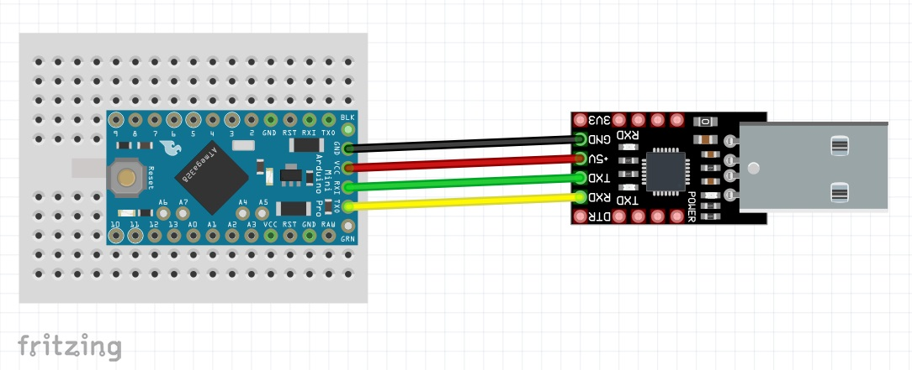
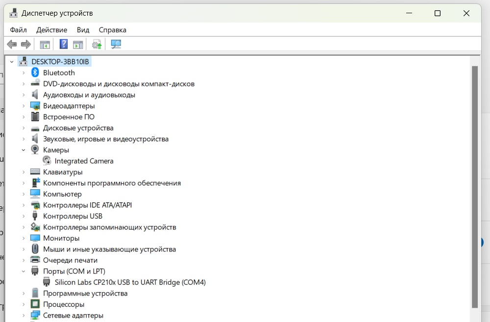
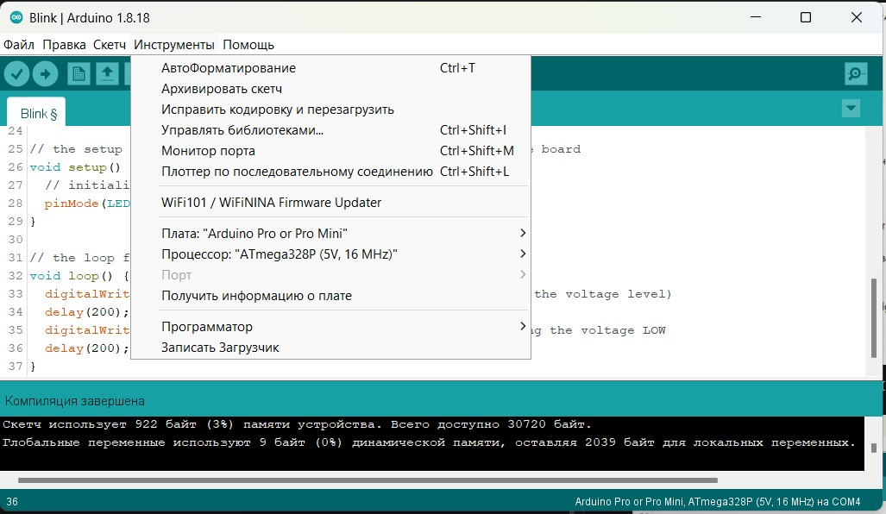
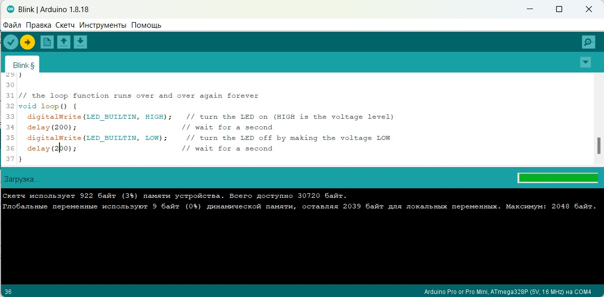
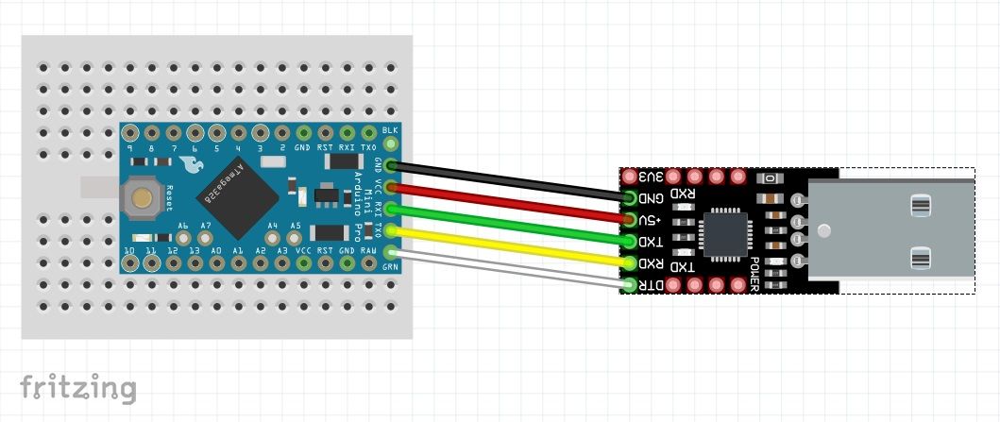

### [Arduino Pro Mini - загрузка скетчей]()

#### Загрузка с помощью USB-TTL (UART) программатора с ручным сбросом

### Библиография

#### [Установка драйвера PL2303 на Windows 10 и 8](https://micro-pi.ru/установка-драйвера-pl2303-windows-10-8/)

В кратце:

а) удалил приложение PL2303 USBtoSerial;

б) установил приложение 1.5.0;

в) обновил драйвер 3.4.25.218 (07.10.2011);

г) перезагрузил компьютер.

#### [Программатор из Arduino](https://tehnopage.ru/zagruzka-sketcha-v-atmega328p)
