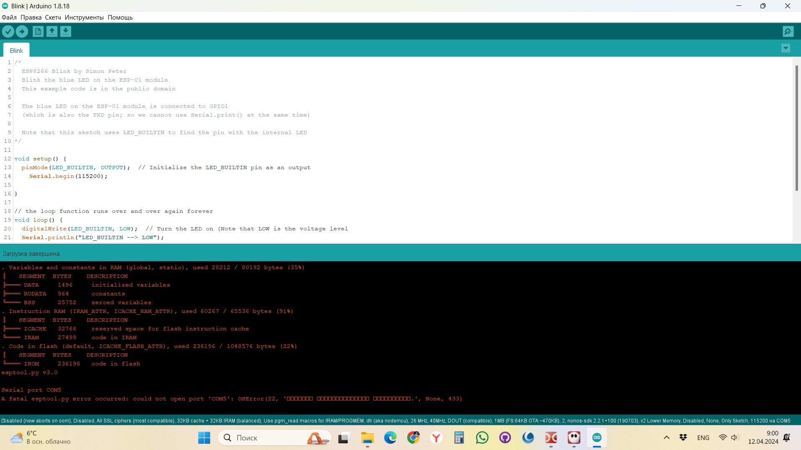

### [Делаем программатор для ESP8266-ESP01](https://github.com/Vladimir-Trufanov/BitofExpert/blob/main/bifeArduino/delaem-programmator-dlya-esp8266-esp01/delaem-programmator-dlya-esp8266-esp01.md)  [2024-04-11]

<b><i>

>
-----Новый Год встретили, а Рождество еще не наступило, мы зашевелились - Таня занялась вязанием и своими вязальными семинарами, а я откопал старый  Redmi Note 4 и думаю: "Что это телефон пропадает, сделаю-ка я из него универсальный пульт".
> 
Занялся. Снял на компьютере коды пульта телевизора, коды для подсветки штор. Бар работает на блютуз, сделаю на следующие новогодние каникулы; сейчас, всё равно, не успею. Ну, думаю, заодно и ёлку подключу к пульту. Коды для включения-выключения придумаю, микроконтроллер запрограммирую.
>
Перебрал удлинитель, сделал выход на реле для подключения к контроллеру. Малость попаял, пристегнул к ёлке датчик, понюхал канифоли, собрал все в кучу. Написал программу для ёлки. В смартфон загрузил все коды.
>
[VK, 2024.01.08](https://vk.com/wall41932239_1133)

</b></i>

<!--
####
-->

Возникла необходимость управлять игрушкой на контроллере Arduino Pro Mini -----.

### Библиография:

**[Конвертер USB-TTL YP-01 на чипе PL2303HX](https://it-otdel.wixsite.com/robototechniks159/konverter-usb-ttl-yp-01)**

Переходник USB to COM позволит подключать различные устройства к компьютеру или ноутбуку, у которых нет COM порта. Данное устройство эмулирует виртуальный COM порт, который в работе ничем не отличается от реального порта.

Для питания различных программируемых устройств имеются выходы 5 В и 3,3 В. Так же на плате имеются три светодиодных индикатора: индикатор питания (PWD) и два для визуальной индикации передачи данных (TXD) и (RXD).

Драйвер на данный конвертер в операционной системе Windows автоматически не устанавливается. Для работы с устройством потребуется скачать и установить драйвер вручную.

[Версия драйвера для версий Windows c 8.1  по 10 х64](https://disk.yandex.ru/d/bXhFI-kB3UR5kq)

[PL2303 драйвер для windows 7-11 / Linux / MacOS](https://voltiq.ru/pl2303-driver-windows-7-10/)

**[4pda - преобразователь USB - UART PL2303 и CP2102](https://4pda.to/forum/index.php?showtopic=1026315)**

**[Дружимся с ESP](https://habr.com/ru/articles/547330/)**

**[Serial Communication - Arduino UNO and ESP8266 (ESP-01)](https://www.youtube.com/watch?v=ji71cHaGW8w)**

В этом видео вы узнаете, как осуществить последовательную связь между платой Arduino UNO и ESP-01. Это видео обязательно нужно посмотреть тем, кто увлекается Arduino и начинает осваивать Интернет вещей с помощью Arduino.

[https://arduino.esp8266.com/stable/package_esp8266com_index.json](https://arduino.esp8266.com/stable/package_esp8266com_index.json)

[SerialCommunication - коды к статье](https://github.com/jatindera/SerialCommunication)

[SoftwareSerial Library](https://docs.arduino.cc/learn/built-in-libraries/software-serial/)

