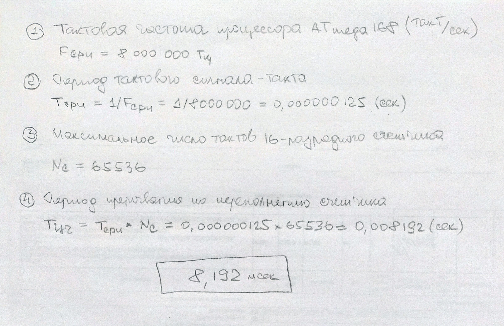

## [Обработка прерываний от таймеров](https://github.com/Vladimir-Trufanov/BitofExpert/blob/main/bifeArduino/obrabotka-preryvanij-ot-tajmerov/obrabotka-preryvanij-ot-tajmerov.md) [2024-03-20]

Обычно при выполнении инструкций скетча Arduino последовательно выполняет все команды функции ***loop()*** в том порядке, в котором они записаны. Прерывания по таймеру позволяют на мгновение приостановить обычную последовательность действий, происходящих в цикле ***loop()***, с точно рассчитанной периодичностью и выполнить отдельный набор команд. Как только эти команды будут выполнены, Arduino снова продолжит работу с того места, где она была прервана.

Прерывания полезны для:

- измерения входящего сигнала с равными интервалами (постоянная частота дискретизации);
- вычисления времени между двумя событиями;
- отправки сигнала определенной частоты;
- периодической проверки входящих данных;
- многое другое...

Для Arduino Nano/UNO/Pro Mini доступно три таймера: ***Timer0, Timer1, Timer2*** (на чипах Atmega168 и Atmega328). Для Arduino MEGA – пять: ***Timer0, Timer1, Timer2, Timer3, Timer4, Timer5***. Так же имеется сторожевой таймер - ***WDT***, который можно использовать для защиты от сбоев или как механизм программного сброса.

***Timer0*** является 8 битным таймером, это означает, что его счетный регистр может хранить числа от 0 до 255 (т.е. байт без знака). Timer0 используется стандартными временными функциями Arduino delay() и millis().

***Timer1*** это 16 битный таймер с максимальным значением счета 65535 (целое без знака). Этот таймер использует библиотека Arduino Servo.

***Timer2*** - 8 битный и очень похож на Timer0. Он используется в Arduino функции tone().

***Timer3, Timer4, Timer5***. Чипы ATmega1280 и ATmega2560 (установлены в вариантах Arduino Mega) имеют три добавочных таймера. Все они 16 битные и работают аналогично Timer1.

### Возникновение прерываний от таймеров

Оттолкнёмся для сведения!

* Arduino Uno - микропроцессор ATmega328P, тактовая частота 16 МГц;
* Arduino Nano - микропроцессор Atmel ATmega168, 16 МГц
* Arduino Pro Mini - микропроцессор ATmega168, 8 МГц
* ESP8266 - 32-битный микропроцессор Tensilica Lx106, 80  МГц 
* ESP32 - 32-битный микропроцессор Xtensa LX6, 160 или 240 МГц

Таймеры увеличивают значение [счетного регистра](#%D1%81%D1%87%D0%B5%D1%82%D0%BD%D1%8B%D0%B9-%D1%80%D0%B5%D0%B3%D0%B8%D1%81%D1%82%D1%80-tcntx) за один такт источника тактовой частоты. Но, ***как правил***о, это очень быстро. Поэтому в [конфигурационном регистре](#%D0%BA%D0%BE%D0%BD%D1%84%D0%B8%D0%B3%D1%83%D1%80%D0%B0%D1%86%D0%B8%D0%BE%D0%BD%D0%BD%D1%8B%D0%B5-%D1%80%D0%B5%D0%B3%D0%B8%D1%81%D1%82%D1%80%D1%8B-tccr) включается коэффициент - предделитель, который меняет счётный регистр за 8, 64, 256 или 1024 такта. 

Источник тактовой частоты может быть внутренний, в этом случае используется тактовая частота процессора, или внешний. В случае внешнего источника изменение счетчика в счетном регистре происходит по переднему или заднему фронту этого внешнего тактового источника.

Таймер увеличивает значение счетного регистра на единичку за раз, пока не достигнет максимального значения, после чего счетчик переполняется, от этого возникает прерывание последовательной работы процессора, счетчик сбрасывается в ноль, процессор быстро отрабатывает маленькую программу прерывания и продолжает прерванные действия. 

Так работает режим Normal (по переполнению счетчика). Второй из основных режимов  - СТС (Clear Timer on Compare или "сброс при совпадении") вызывает прерывание и сброс значения счетного регистра при совпадению со значением [регистра сравнения](#%D1%80%D0%B5%D0%B3%D0%B8%D1%81%D1%82%D1%80-%D1%81%D1%80%D0%B0%D0%B2%D0%BD%D0%B5%D0%BD%D0%B8%D1%8F-ocrx).

### Расчет значения счетчика для прерывания

Для понимания вопроса сделаем несколько расчетов для Arduino Pro Mini - микропроцессора ATmega168, 8 МГц.

#### *1. Определяем интервал для возникновения прерывания по переполнению первого таймера.*



#### *2. Определяем интервал для возникновения прерывания по переполнению нулевого таймера.*

В предыдущем расчете определили, что переполнение первого 16-разрядного  счетчика для Arduino Pro Mini наступает примерно через 8 миллисекунд.

Сделаем расчет для нулевого 8-разрядного счетчика:
```
Fcpu = 8000000 Гц                         - тактовая частота процессора
Tcpu = 1/Fcpu=1/8000000=0,000000125 сек   - период тактового сигнала
Nc   = 128                                - максимальное число тактов

Период до прерывания по переполнению счетчика:
Tisr = Tcpu * Nc = 0,000000125 * 256 = 0,000032 с
```
Таким образом переполнение счетного регистра нулевого таймера наступает через 0,032 мсек.

#### *3. Выполняем расчет для выполнения прерывания первого таймера по совпадению значений регистров через 1 секунду.*

Для использования режима СТС с целью получения интервала в одну секунду нужно определить два значения для размещения их в регистрах таймера: 

- предделитель выбираем равным 1024 (предварительно), что обеспечивает изменение счетчика (счетного регистра) не по каждому такту процессора, а по прошествии 1024 тактов;
- значение счетчика определяем следующим образом за несколько шагов:

1. Разрешение таймера = 1 / (тактовая частота контроллера / предделитель)
 
2. Значение счетчика = интервал таймера / разрешение таймера - 1
(дополнительная единица добавляется к счетчику потому, что при совпадении счетчика с заданным значением он сбросится в ноль. Сброс занимает один тактовый период, который надо учесть в расчетах. Во многих случаях ошибка в один период не слишком значима, но в высокоточных задачах она может быть критичной).

```
Разрешение таймера = 1 / (8000000 / 1024) = 0,000128 (cек)
Значение счетчика  = 1 / 0,000128 - 1 = 7811,5 ~ 7812
```
Здесь мы получили значение счетчика равным 7811.5, если нам не критично "плюс-минус", то можем округлить и с такими данными работать. 

Но, лучше, подобрать другой предделитель. Пусть будет 256.
 
```
Разрешение таймера = 1 / (8000000 / 256) = 0,000032 (cек)
Значение счетчика  = 1 / 0,000032 - 1 = 31250 - 1 = 31249
```
Таким образом значение счетчика для сравнения целое и меньше 65536, что и требуется. Можно программировать прерывание.

#### [Скетч "Обеспечить мигание светодиода с интервалом в 1 сек на плате Arduino Uno"](simple1/simple1.ino)

> Следует заметить, что предделитель нужно выбирать аккуратно для малых временных интервалов, таким образом, чтобы, по возможности, отсутствовала дробная часть в количестве тактов для счетчика.
> 

### [Использование ключевого слова volatile](http://www.pic24.ru/doku.php/osa/articles/volatile_for_chainiks)

Работа с переменными, объявляемыми в скетчах, компилятором подвергаются оптимизации. Внутреннее размещение и действия с ними, их структура могут быть изменены. Если это выполняется в последовательном коде (без прерываний кода), то модификации переменных нивелируются и проблемы не возникает.

Теперь возьмём легко понимаемый пример. Пусть программист использует два бита для управления своими процессами и формирует следующий фрагмент кода
```
char a = 0;
...
a |= 1;
...
a |= 2;
...
```
С точки зрения алгоритма устанавливаются два младших разряда в переменной a по разным причинам. Между установлением одного и второго разряда в переменной может вклиниться прерывание, пусть оно работает правильно, разберется с битами и сделает своё дело.

Но оптимизатор компилятора может сделать подмену двух действий одним оператором:
```
a |= 3; 
```
В этом случае ***логика взаимодействия*** между прерыванием и основным последовательным кодом ***изменится***. Поэтому переменные, использование которых изменчиво, и которые, предположительно, могут повлиять на правильное поведение кода, следует объявлять изменчивыми (волотильными).

***Типичным случаем*** для описания переменных, как волотильных, являются многопотоковые приложения (в т.ч. с обработчиками прерываний), когда две задачи обмениваются информацией через совместно используемый адрес ячейки памяти (глобальную переменную):

```
int cntr;

void task1(void)
{
    cntr = 0;
    
    while (cntr == 0)
    {
        sleep(1);
    }
    ...
}

void task2(void)
{
    ...
    cntr++;
    sleep(10);
    ...
}
```
> 
В общем случае, переменные, к которым нужно обращаться из основного кода и из обработчиков прерываний нужно помечать, как изменчивые (волотильные) с помощью квалификатора ***volatile***.
>
 
Ключевое слово volatile пишется до или после типа данных объявляемой переменной.
```
volatile int cntr;
int volatile cntr;
```

> Переменная должна быть объявлена с ключевым словом volatile  всякий раз, когда ее значение может измениться неожиданно. 
> 

#### [Скетч "Управлять светодиодом, используя прерывание по переполнению таймера"](simple2/simple2.ino)

### [Регистры настроек таймеров](https://chipenable.ru/index.php/programming-avr/171-avr-timer-t0-ch1.html)

#### Счетный регистр TCNTx

Это 8-ми разрядный счетный регистр (Timer/CouNTer - TCNT0, TCNT1, TCNT2 ...). Когда таймер работает, по каждому импульсу тактового сигнала значение TCNTx изменяется на единицу. В зависимости от режима работы таймера, счетный регистр может или увеличиваться, или уменьшаться.
 
Регистр TCNTx можно как читать, так и записывать. Последнее используется если требуется задать его начальное значение. Когда таймер работает, изменять содержимое счетного регистра не рекомендуется, так как это блокирует схему сравнения на один такт.

|TCNTx							| 7		| 6  	| 5  	| 4  	|  3  	| 2  	| 1  	| 0  	|
|:-    									|:-: 		| :-: 	| :-: 	| :-: 	| :-: 	| :-: 	| :-: 	| :-: 	|
|ReadWrite   					| RW	|RW	|RW	|RW	|RW	|RW	|RW	|RW	|
|Начальное значение	| 0		| 0  	| 0 	| 0  	| 0	| 0  	| 0 	| 0  	|

#### Регистр сравнения OCRx

Это 8-ми разрядный регистр сравнения (Output Compare Register - OCR0, OCR2) или 16-ти разрядный (два канала - OCR1A, OCR1B). Его значение постоянно сравнивается со счетным регистром TCNTx и в случае совпадения таймер может выполнять какие-то действия - вызывать прерывание, менять состояние вывода и т.д. в зависимости от режима работы.  Значение OCRx можно как читать, так и записывать.

|OCRx 							| 7		| 6  	| 5  	| 4  	|  3  	| 2  	| 1  	| 0  	|
|:-    									| :-: 		| :-: 	| :-: 	| :-: 	| :-: 	| :-: 	| :-: 	| :-: 	|
|ReadWrite   					| RW	|RW	|RW	|RW	|RW	|RW	|RW	|RW	|
|Начальное значение	| 0		| 0  	| 0 	| 0  	| 0	| 0  	| 0 	| 0  	|

#### Конфигурационные регистры TCCR

Конфигурационные регистры (Timer/Counter Control Register) TCCRxA, TCCRxB, где x - номер таймера, определяют управление таймерами-счётчиками и содержат установочные биты: источник тактирования таймера, коэффициент предделителя, режим работы таймера-счетчика и поведение вывода. 

|TCCRxA				|COMxA1	|COMxA0	|COMxB1	|COMxB0	| -	| -	|WGMx1	|WGMx0	|
|:-    							| :-: 				| :-: 				| :-: 				| :-: 				|:-:|:-:| :-: 			| :-: 			|
|Бит  						| 7				| 6  				| 5  				| 4  				|3 |2	| 1  			| 0  			|
|ReadWrite				| RW			|RW				|RW				|RW				|R	|R	|RW			|RW			|
|Начал. значение	| 0				| 0  				| 0 				| 0  				|0	|0	| 0 			| 0  			|
 
Биты WGMx1, WGMx0 (***Wave Generator Mode***) - определяют режим работы таймера-счетчика. Всего их может быть четыре - нормальный режим (normal), сброс таймера при совпадении (CTC), и два режима широтно-импульсной модуляции (FastPWM и Phase Correct PWM). 

| WGMx1		|WGMx0	| Описание																								| 
|  :-:				| :-:			| :-																												|
|  0				| 0  			| Нормальный режим (Normal)																| 
|  0				| 1  			| Режим широтно-импульсной модуляции - Phase Correct PWM		| 
|  1				| 0  			| Cброс таймера при совпадении (CTC)												| 
|  1				| 1  			| Режим широтно-импульсной модуляции - FastPW							| 


Поведение вывода таймера зависит от режима работы. В режимах Normal и СTC вывод ведет себя одинаково, а вот в режимах широтно-импульсной модуляции его поведение отличается.

Биты ***COM (Compare Match Output Mode)*** - определяют поведение вывода таймера. Если хоть один из этих битов установлен в 1, то вывод таймера перестает функционировать как обычный вывод общего назначения и подключается к схеме сравнения таймера счетчика. Однако при этом он должен быть еще настроен как выход.
 
|TCCRxB						|ICNCx|ICESx|-	|WGMx3	|WGMx2	|CSx2	|CSx1	|CSx0	|
|:-    									| :-: 		| :-: 		|:-:| :-: 			|:-:			|:-:		| :-: 		| :-: 		|
|Бит  								| 7		| 6  		|5 | 4  			|3 			|2			| 1  		| 0  		|
|ReadWrite						| RW	|RW		|R	|RW			|RW			|RW		|RW		|RW		|
|Начальное значение	| 0		| 0  		|0 | 0  			|0				|0			| 0 		| 0  		|

Биты CSx2, CSx1, CSx0 (***Clock Select***) - определяют источник тактовой частоты для таймера Тx и задают коэффициент предделителя.  Таймер-счетчик может быть остановлен, может тактироваться от внутренней частоты и также может тактироваться от сигнала на выводе.

| CSx2	| CSx1	| CSx0	| Описание																							| 
| :-: 		| :-:		| :-:		| :-																											|
| 0 		| 0		| 0  		| Нет тактового источника (таймер-счетчик остановлен)				| 
| 0 		| 0		| 1  		| Тактовая частота контроллера														| 
| 0 		| 1		| 0  		| Тактовая частота контроллера / 8 - делитель частоты				| 
| 0 		| 1		| 1  		| Тактовая частота контроллера / 64												| 
| 1 		| 0		| 0  		| Тактовая частота контроллера / 256												| 
| 1 		| 0		| 1  		| Тактовая частота контроллера / 1024 											| 
| 1 		| 1		| 0  		| Внешний источник. Тактирование по спаду - заднему фронту		 
| 1 		| 1		| 1  		| Внешний тактовый источник. Тактирование по переднему фронту 

#### TIMSK - регистр маски прерываний таймеров

Общий регистр (Timer/Counter Interrupt Mask Register) для трех таймеров; он содержит флаги разрешения прерываний. Например Timer0 может вызывать прерывания при переполнении счетного регистра TCNT0 и при совпадении счетного регистра с регистром сравнения OCR0. Соответственно для этого таймера в регистре TIMSK зарезервированы два бита - это TOIE0 и OCIE0. 
```
TOIE0: 0-е значение бита запрещает прерывание по событию переполнение, 
       1 - разрешает. 
OCIE0: 0-е значение запрещает прерывания по событию совпадение, 
       1 - разрешает.
```
Остальные биты относятся к другим таймерам.

|TIMSK							|OCIE2|TOIE2|TICIE1|OCIE1A|OCIE1B|TOIE1|OCIE0|TOIE0|
|:-    									| :-: 		| :-: 		| :-: 		|:-: 			| :-: 			| :-: 		| :-: 		| :-: 		|
|Бит  								| 7		| 6  		| 5  		| 4 			|  3  			| 2  		| 1  		| 0  		|
|ReadWrite   					| RW	| RW	| RW	| RW		| RW		| RW	| RW	| RW	|
|Начальное значение	| 0		| 0  		| 0 		| 0  			| 0			| 0  		| 0 		| 0  		|

```
7 бит - OCIE2  - прерывание в случаи совпадения TC2 - Timer2
6 бит - TOIE2  - прерывание в случае переполнения TC2 
5 бит - TICIE1 - прерывания в случае захвата TC1 - Timer1
4 бит - OCIE1A - прерывание в случае совпадения A TC1
3 бит - OCIE1B - прерывание в случае совпадения B TC1
2 бит - TOIE1  - прерывание в случае переполнения TC1
1 бит - OCIE0  - прерывание в случае совпадения TC0
0 бит - TOIE0  - прерывание в случае переполнения TC0 - Timer0
```

### [Вызов обработчиков прерываний](http://adior.ru/index.php/robototekhnika/178-timer-interrupt)

Обработка таймерных прерываний ведётся в стандартной функции ***ISR***, которой передаётся обязательный и единственный параметр (вектор обработчика прерывания).  Параметр напрямую связан с конкретным таймером и режимом работы счетчика, имена функции и параметров зарезервированы и их изменить нельзя.

Векторы обработчиков прерываний:
```
WDT_vect          - прерывание от сторожевого таймера
TIMER2_COMPA_vect - прерывание от таймера/счетчика T2 при совпадении с A
TIMER2_COMPB_vect - прерывание от таймера/счетчика T2 при совпадении с B
TIMER2_OVF_vect   - прерывание по переполнению таймера/счетчика T2
TIMER1_CAPT_vect  - прерывание по захвату таймера/счетчика T1 (по записи)
TIMER1_COMPA_vect - прерывание от таймера/счетчика T1 при совпадении с A
TIMER1_COMPB_vect - прерывание от таймера/счетчика T1 при совпадении с B
TIMER1_OVF_vect   - прерывание по переполнению таймера/счетчика T1
TIMER0_COMPA_vect - прерывание от таймера/счетчика T0 при совпадении с A
TIMER0_COMPB_vect - прерывание от таймера/счетчика T0 при совпадении с B
TIMER0_OVF_vect   - прерывание по переполнению таймера/счетчика T0
```

Поэтому цель обработчика прерывания в Arduino всегда реализуется в коде функции с именем ***ISR*** и с правильно выбранным вектором обработки.

Каждый таймер может генерировать несколько типов прерываний. Тип прерывания и его временные параметры зависят от значений служебных битов в специальных регистрах управления.

Общую картину по запущенным или не запущенным обработчикам прерываний можно увидеть через статусный регистр TIFR (Timer/Counter Interrupt Flag Register).

#### TIFR -  статусный регистр

Общий для всех таймеров-счетчиков регистр. Содержит статусные флаги, которые устанавливаются при возникновении событий. Для таймера Т0: TOV0 устанавливается в 1 при переполнении счетного регистра TCNT0, OCF0 - устанавливается в 1 при совпадении счетного регистра с регистром сравнения OCR0. 

Если в эти моменты в регистре TIMSK разрешено прерывание и установлен соответствующий бит, то микроконтроллер вызовет обработчик.

Флаги автоматически очистятся при запуске обработчика прерывания. 

|TIFR								|OCF2	|TOV2	|ICF1|OCF1А|OCF1B|TOV1|OCF0| TOV0| 
|:-    									| :-: 		| :-: 		| :-:	| :-: 			| :-: 		| :-: 		| :-: 		| :-: 		|
|Бит  								| 7		| 6  		| 5  	| 4  			|  3  		| 2  		| 1  		| 0  		|
|ReadWrite   					| RW	|RW		|RW	|RW			|RW		|RW		|RW		|RW		|
|Начальное значение	| 0		| 0  		| 0 	| 0  			| 0		| 0  		| 0 		| 0  		|

### Библиография

#### 1.  [Arduino Timer Interrupts](https://www.instructables.com/Arduino-Timer-Interrupts/) - https://www.instructables.com/Arduino-Timer-Interrupts/ 

#### 2. [Arduino и прерывания таймера](https://habr.com/ru/articles/453276/) - https://habr.com/ru/articles/453276/

#### 3. [Timer interrupts](https://arduinodiy.wordpress.com/2012/02/28/timer-interrupts/) - https://arduinodiy.wordpress.com/2012/02/28/timer-interrupts/ 

#### 4. [Как использовать ключевое слово volatile](https://chipenable.ru/index.php/programming-c/60-how-to-use-cs-volatile-keyword.html) - https://chipenable.ru/index.php/programming-c/60-how-to-use-cs-volatile-keyword.html


