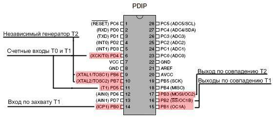

### [Обработка прерываний от таймеров](https://github.com/Vladimir-Trufanov/BitofExpert/blob/main/bifeArduino/obrabotka-preryvanij-ot-tajmerov/obrabotka-preryvanij-ot-tajmerov.md) [2024-03-20]

Обычно при выполнении инструкций скетча Arduino последовательно выполняет все команды функции ***loop()*** в том порядке, в котором они записаны. Прерывания по таймеру позволяют на мгновение приостановить обычную последовательность действий, происходящих в цикле ***loop()***, с точно рассчитанной периодичностью и выполнить отдельный набор команд. Как только эти команды будут выполнены, Arduino снова продолжит работу с того места, где она была прервана.

Прерывания полезны для:

- измерения входящего сигнала с равными интервалами (постоянная частота дискретизации);
- вычисления времени между двумя событиями;
- отправки сигнала определенной частоты;
- периодическая проверки входящих данных;
- многое другое...

Для Arduino Nano/UNO/Pro Mini доступно три таймера: ***Timer0, Timer1, Timer2*** (т.е. на чипах Atmega168 и Atmega328). Для Arduino MEGA – пять: ***Timer0, Timer1, Timer2, Timer3, Timer4, Timer5***. Так же имеется сторожевой таймер - ***WDT***, который можно использовать для защиты от сбоев или как механизм программного сброса.

***Timer0*** является 8 битным таймером, это означает, что его счетный регистр может хранить числа вплоть до 255 (т.е. байт без знака). Timer0 используется стандартными временными функциями Arduino delay() и millis().

***Timer1*** это 16 битный таймер с максимальным значением счета 65535 (целое без знака). Этот таймер использует библиотека Arduino Servo.

***Timer2*** - 8 битный и очень похож на Timer0. Он используется в Arduino функции tone().

***Timer3, Timer4, Timer5***. Чипы ATmega1280 и ATmega2560 (установлены в вариантах Arduino Mega) имеют три добавочных таймера. Все они 16 битные и работают аналогично Timer1.

#### [Примерный общий вид файла FZP](LCD-FM-RX-V2.0.xml)

### [Регистры настроек таймеров](https://chipenable.ru/index.php/programming-avr/171-avr-timer-t0-ch1.html)

#### Счетный регистр TCNT0 (TCNT1, TCNT2 ...)

Это 8-ми разрядный счетный регистр. Когда таймер работает, по каждому импульсу тактового сигнала значение TCNTx изменяется на единицу. В зависимости от режима работы таймера, счетный регистр может или увеличиваться, или уменьшаться.
 
Регистр TCNTx можно как читать, так и записывать. Последнее используется если требуется задать его начальное значение. Когда таймер работает, изменять содержимое счетного регистра не рекомендуется, так как это блокирует схему сравнения на один такт.

|TCNTx							|     		|     	|     	|     	|     	|     	|     	|     	| 
|:-    									|:-: 		| :-: 	| :-: 	| :-: 	| :-: 	| :-: 	| :-: 	| :-: 	|
|Бит  								| 7		| 6  	| 5  	| 4  	|  3  	| 2  	| 1  	| 0  	|
|ReadWrite   					| RW	|RW	|RW	|RW	|RW	|RW	|RW	|RW	|
|Начальное значение	| 0		| 0  	| 0 	| 0  	| 0	| 0  	| 0 	| 0  	|

#### Регистр сравнения OCR0 (OCR1A, OCR1B, OCR2 ...)

Это 8-ми разрядный регистр сравнения (OCR0,OCR2) или 16-ти разрядный (OCR1A, OCR1B). Его значение постоянно сравнивается со счетным регистром TCNTx и в случае совпадения таймер может выполнять какие-то действия - вызывать прерывание, менять состояние вывода и т.д. в зависимости от режима работы.  Значение OCRx можно как читать, так и записывать.

|OCRx								|     		|     	|     	|     	|     	|     	|     	|     	| 
|:-    									| :-: 		| :-: 	| :-: 	| :-: 	| :-: 	| :-: 	| :-: 	| :-: 	|
|Бит  								| 7		| 6  	| 5  	| 4  	|  3  	| 2  	| 1  	| 0  	|
|ReadWrite   					| RW	|RW	|RW	|RW	|RW	|RW	|RW	|RW	|
|Начальное значение	| 0		| 0  	| 0 	| 0  	| 0	| 0  	| 0 	| 0  	|

#### Конфигурационные регистры TCCR0A,TCCR0B

Конфигурационные регистры TCCRxA, TCCRxB, где x - номер таймера, определяют управление таймерами-счётчиками и содержат установочные биты: источник тактирования таймера, коэффициент предделителя, режим работы таймера-счетчика и поведение вывода. 

|TCCRxA				|     				|     				|     				|     				| 	| 	|     			|     			| 
|:-    							| :-: 				| :-: 				| :-: 				| :-: 				|:-:|:-:| :-: 			| :-: 			|
|Бит  						| 7				| 6  				| 5  				| 4  				|3 |2	| 1  			| 0  			|
|   							|COMxA1	|COMxA0	|COMxB1	|COMxB0	| -	| -	|WGMx1	|WGMx0	|
|ReadWrite				| RW			|RW				|RW				|RW				|R	|R	|RW			|RW			|
|Начал. значение	| 0				| 0  				| 0 				| 0  				|0	|0	| 0 			| 0  			|
<br>

|TCCRxB						|     		|     		|	|     			| 				| 			|     		|     		| 
|:-    									| :-: 		| :-: 		|:-:| :-: 			|:-:			|:-:		| :-: 		| :-: 		|
|Бит  								| 7		| 6  		|5 | 4  			|3 			|2			| 1  		| 0  		|
|   									|ICNCx|ICESx|-	|WGMx3	|WGMx2	|CSx2	|CSx1	|CSx0	|
|ReadWrite						| RW	|RW		|R	|RW			|RW			|RW		|RW		|RW		|
|Начальное значение	| 0		| 0  		|0 | 0  			|0				|0			| 0 		| 0  		|

> 	Биты CSx2, CSx1, CSx0 (***Clock Select***) - определяют источник тактовой частоты для таймера Тx и задают коэффициент предделителя.  Таймер-счетчик может быть остановлен, может тактироваться от внутренней частоты и также может тактироваться от сигнала на выводе.
> 	 

| CSx2	| CSx1	| CSx0	| Описание																							| 
| :-: 		| :-:		| :-:		| :-																											|
| 0 		| 0		| 0  		| Нет тактового источника (таймер-счетчик остановлен)				| 
| 0 		| 0		| 1  		| Тактовая частота контроллера														| 
| 0 		| 1		| 0  		| Тактовая частота контроллера / 8 - делитель частоты				| 
| 0 		| 1		| 1  		| Тактовая частота контроллера / 64												| 
| 1 		| 0		| 0  		| Тактовая частота контроллера / 256												| 
| 1 		| 0		| 1  		| Тактовая частота контроллера / 1024 											| 
| 1 		| 1		| 0  		| Внешний источник. Тактирование по спаду - заднему фронту		 
| 1 		| 1		| 1  		| Внешний тактовый источник. Тактирование по переднему фронту 

> Биты WGMx1, WGMx0 (***Wave Generator Mode***) - определяют режим работы таймера-счетчика. Всего их может быть четыре - нормальный режим (normal), сброс таймера при совпадении (CTC), и два режима широтно-импульсной модуляции (FastPWM и Phase Correct PWM). 
> 

| WGMx1		|WGMx0	| Описание																								| 
|  :-:				| :-:			| :-																												|
|  0				| 0  			| Нормальный режим (Normal)																| 
|  0				| 1  			| Режим широтно-импульсной модуляции - Phase Correct PWM		| 
|  1				| 0  			| Cброс таймера при совпадении (CTC)												| 
|  1				| 1  			| Режим широтно-импульсной модуляции - FastPW							| 

Биты ***COM (Compare Match Output Mode)*** - определяют поведение вывода таймера. Если хоть один из этих битов установлен в 1, то вывод таймера перестает функционировать как обычный вывод общего назначения и подключается к схеме сравнения таймера счетчика. Однако при этом он должен быть еще настроен как выход.

Поведение вывода таймера зависит от режима работы. В режимах Normal и СTC вывод ведет себя одинаково, а вот в режимах широтно-импульсной модуляции его поведение отличается.

#### TIMSK - регистр маски прерываний таймеров

Общий регистр для трех таймеров; он содержит флаги разрешения прерываний. Например Timer0 может вызывать прерывания при переполнении счетного регистра TCNT0 и при совпадении счетного регистра с регистром сравнения OCR0. Соответственно для этого таймера в регистре TIMSK зарезервированы два бита - это TOIE0 и OCIE0. 
```
TOIE0: 0-е значение бита запрещает прерывание по событию переполнение, 
       1 - разрешает. 
OCIE0: 0-е значение запрещает прерывания по событию совпадение, 
       1 - разрешает.
```
Остальные биты относятся к другим таймерам.

|TIMSK							|     		|     		|     		|				|     			|     		|     		|     		| 
|:-    									| :-: 		| :-: 		| :-: 		|:-: 			| :-: 			| :-: 		| :-: 		| :-: 		|
|Бит  								| 7		| 6  		| 5  		| 4 			|  3  			| 2  		| 1  		| 0  		|
|  										|OCIE2|TOIE2|TICIE1|OCIE1A|OCIE1B|TOIE1|OCIE0|TOIE0|
|ReadWrite   					| RW	| RW	| RW	| RW		| RW		| RW	| RW	| RW	|
|Начальное значение	| 0		| 0  		| 0 		| 0  			| 0			| 0  		| 0 		| 0  		|

```
7 бит - OCIE2  - прерывание в случаи совпадения TC2 - Timer2
6 бит - TOIE2  - прерывание в случае переполнения TC2 
5 бит - TICIE1 - прерывания в случае захвата TC1 - Timer1
4 бит - OCIE1A - прерывание в случае совпадения A TC1
3 бит - OCIE1B - прерывание в случае совпадения B TC1
2 бит - TOIE1  - прерывание в случае переполнения TC1
1 бит - OCIE0  - прерывание в случае совпадения TC0
0 бит - TOIE0  - прерывание в случае переполнения TC0 - Timer0
```




```
WDT_vect - прерывание от сторожевого таймера
TIMER2_COMPA_vect - прерывание от таймера/счетчика T2 при совпадении с A
TIMER2_COMPB_vect - прерывание от таймера/счетчика T2 при совпадении с B
TIMER2_OVF_vect - прерывание по переполнению таймера/счетчика T2
TIMER1_CAPT_vect - прерывание от таймера/счетчика T1 по записи
TIMER1_COMPA_vect - прерывание от таймера/счетчика T1 при совпадении с A
TIMER1_COMPB_vect - прерывание от таймера/счетчика T1 при совпадении с B
TIMER1_OVF_vect - прерывание по переполнению таймера/счетчика T1
TIMER0_COMPA_vect - прерывание от таймера/счетчика T0 при совпадении с A
TIMER0_COMPB_vect - прерывание от таймера/счетчика T0 при совпадении с B
TIMER0_OVF_vect - прерывание по переполнению таймера/счетчика T0

CTC (Clear Timer on Compare) или "сброс при совпадении".
```


### Библиография

#### 1.  [Arduino Timer Interrupts](https://www.instructables.com/Arduino-Timer-Interrupts/) - https://www.instructables.com/Arduino-Timer-Interrupts/ 

#### 2. [Arduino и прерывания таймера](https://habr.com/ru/articles/453276/) - https://habr.com/ru/articles/453276/

#### [Timer interrupts](https://arduinodiy.wordpress.com/2012/02/28/timer-interrupts/) 

#### [Прерывания по таймерам в Arduino](http://adior.ru/index.php/robototekhnika/178-timer-interrupt) 

#### [Прерывания по таймеру](https://alexgyver.ru/lessons/timer-isr/) 

#### [Настройка таймера в AVR микроконтроллере](https://radio-magic.ru/microcontrollers/30-avr-timer) 


