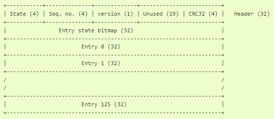
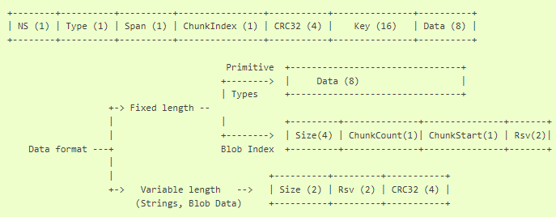

## [Изучаем NVS - энергонезависимое хранилище параметров]()

Практически любой проект автоматики требует применения настраиваемых во время работы программы параметров – ну например желаемая температура для термостата или пароль для подключения к сети WiFi. Получить эти данные с сервера или с панели управления не особо сложно, но сразу же возникает следующий вопрос – а что делать после перезагрузки или выключения и включения устройства? Нужно где-то хранить последнее установленное значение непосредственно на ESP.

Разработчики ESP32 и ESP-IDF позаботились об этом, и предусмотрели специальный раздел для хранения данных в виде пар “ключ-значение” – Non-volatile Storage Library или кратко NVS. Этот механизм очень напоминает текстовые INI-файлы Windows и другие конфигурационные файлы.

---

### [Ключевые особеннoсти NVS API](#%D0%BA%D0%BB%D1%8E%D1%87%D0%B5%D0%B2%D1%8B%D0%B5-%D0%BE%D1%81%D0%BE%D0%B1%D0%B5%D0%BD%D0%BD%D0%BE%D1%81%D1%82%D0%B8-nvs-api)

### [Как устрoена NVS](#%D0%BA%D0%B0%D0%BA-%D1%83%D1%81%D1%82%D1%80%D0%BE%D0%B5%D0%BD%D0%B0-nvs)

### [Рабoта с NVS API](#%D1%80%D0%B0%D0%B1%D0%BE%D1%82%D0%B0-%D1%81-nvs-api)

### [Примеры чтения и записи в энергoнезависимое хранилище](#%D0%BF%D1%80%D0%B8%D0%BC%D0%B5%D1%80%D1%8B-%D1%87%D1%82%D0%B5%D0%BD%D0%B8%D1%8F-%D0%B8-%D0%B7%D0%B0%D0%BF%D0%B8%D1%81%D0%B8-%D0%B2-%D1%8D%D0%BD%D0%B5%D1%80%D0%B3%D0%BE%D0%BD%D0%B5%D0%B7%D0%B0%D0%B2%D0%B8%D1%81%D0%B8%D0%BC%D0%BE%D0%B5-%D1%85%D1%80%D0%B0%D0%BD%D0%B8%D0%BB%D0%B8%D1%89%D0%B5)

### [Arduinо NVS Library](#arduino-nvs-library)

### [Библиoграфия](#%D0%B1%D0%B8%D0%B1%D0%BB%D0%B8%D0%BE%D0%B3%D1%80%D0%B0%D1%84%D0%B8%D1%8F)

---

### Ключевые особенности NVS API

#### [Первоисточник: NVS - энергонезависимая библиотека хранения параметров](https://kotyara12.ru/iot/esp32_nvs/)

Хранилище NVS в своей работе использует две основные сущности: страницы и записи. Страница — это логическая структура, в которой хранится часть общего набора данных. Логическая страница соответствует одному физическому сектору флэш-памяти или 4096 байт. Страница состоит из трех частей: заголовка, карты записей и самих записей. 




NVS работает с парами ключ-значение. Одна пара ключ-значение называется записью. Размер записи фиксирован и равен 32 байта. Но под непосредственно данные из них остается всего 8 байт, остальное место занимают служебные данные. А что если требуется хранить данные длиннее 8 байт? Тогда используется сразу несколько записей – см. иллюстрацию ниже.



Собственно данные могут иметь один из следующих типов:

- целые (int8_t – uint64_t)
- строка не длиннее 4000 байт
- двоичные данные (blob)

Все остальные типы данных (например float) должны быть приведены к одному из вышеперечисленных типов.

> Как видно из схемы, длина ключа не должна превышать 15 символов (15 + завершающий ноль). Ключи должны быть уникальными. Говоря простыми словами ключ – это уникальное имя записи, или идентификатор, по которому API находит запрашиваемую запись.

Все ключи должны быть объединены в одном из пространств имен (группе). Длина имени группы также не должна превышать 15 символов. 

Можно использовать шифрование данных в разделах NVS, дополнительно защищая чувствительные данные.

###### [в начало](#%D0%B8%D0%B7%D1%83%D1%87%D0%B0%D0%B5%D0%BC-nvs---%D1%8D%D0%BD%D0%B5%D1%80%D0%B3%D0%BE%D0%BD%D0%B5%D0%B7%D0%B0%D0%B2%D0%B8%D1%81%D0%B8%D0%BC%D0%BE%D0%B5-%D1%85%D1%80%D0%B0%D0%BD%D0%B8%D0%BB%D0%B8%D1%89%D0%B5-%D0%BF%D0%B0%D1%80%D0%B0%D0%BC%D0%B5%D1%82%D1%80%D0%BE%D0%B2)

### Как устроена NVS

NVS хранит записи последовательно друг за другом, а новые записи добавляются в конец активной страницы. При удалении запись помечается, как удаленная.

При изменении в конце страницы добавляется новая пара ключ-значение, а старая запись помечается как удаленная. Как только вся страница будет заполнена, система открывает следующую страницу, и т.д. 

Страницы, которые используются, имеют связанные с ними порядковые номера. Более высокие порядковые номера соответствуют страницам, которые были созданы позже. Отображение секторов флэш-памяти в логические страницы не имеет какого-либо определенного порядка. Библиотека проверит порядковые номера страниц, найденных в каждом секторе флэш-памяти, и организует страницы в список на основе этих номеров.

Когда все записи на странице будут помечены как удаленные, страница может быть “отформатирована” для повторного использования. Но пока есть свободные страницы, обычно просто используется следующая страница. Когда все страницы заполнены, NVS попробует “отформатировать” страницы, занятые только удаленными записями. При этом если на странице осталось мало действующих записей, NVS может принудительно переместить их на новое место для стирания данной страницы. После этого страницы можно использовать повторно. 

Всё это позволяет значительно снизить физический износ микросхемы flash-памяти, так как при каждом новом изменении пары ключ-значение запись будет происходить по новому физическому адресу. 

> Недостаток NVS - для индексации записей используется оперативная память из кучи. Поэтому, при каждой новой записи количество свободных байт в куче будет немного уменьшаться. До тех пор, пока очередная страница не будет удалена полностью – тогда свободный остаток кучи скачкообразно увеличивается.


###### [в начало](#%D0%B8%D0%B7%D1%83%D1%87%D0%B0%D0%B5%D0%BC-nvs---%D1%8D%D0%BD%D0%B5%D1%80%D0%B3%D0%BE%D0%BD%D0%B5%D0%B7%D0%B0%D0%B2%D0%B8%D1%81%D0%B8%D0%BC%D0%BE%D0%B5-%D1%85%D1%80%D0%B0%D0%BD%D0%B8%D0%BB%D0%B8%D1%89%D0%B5-%D0%BF%D0%B0%D1%80%D0%B0%D0%BC%D0%B5%D1%82%D1%80%D0%BE%D0%B2)

### Работа с NVS API

Прежде чем начинать пользоваться разделом NVS, его нужно инициализировать, например, как в следующем скетче:

```
esp_err_t err = nvs_flash_init();
if ((err == ESP_ERR_NVS_NO_FREE_PAGES) || (err == ESP_ERR_NVS_NEW_VERSION_FOUND)) 
{
  ESP_LOGW("NVS", "Erasing NVS partition...");
  nvs_flash_erase();
  err = nvs_flash_init();
};
if (err == ESP_OK) 
{
  ESP_LOGI("NVS", "NVS partition initilized");
} 
else 
{
  ESP_LOGE("NVS", "NVS partition initialization error: %d (%s)", err, esp_err_to_name(err));
};
```

В приведенном коде пытаемся открыть NVS раздел с помощью nvs_flash_init(). Если функция возвращает состояние “нет свободных страниц” или “найдена новая версия”, то стираем раздел и пытаемся инициализировать его повторно. 

Затем можно уже начинать открывать пространство имен и работать с ним. Открыть пространство имен можно в режиме “только чтение” или “чтение и запись”:

```
bool nvsOpen(const char* name_group, nvs_open_mode_t open_mode, nvs_handle_t *nvs_handle)
{
  esp_err_t err = nvs_open(name_group, open_mode, nvs_handle); 
  if (err != ESP_OK) 
  {
    if (!((err == ESP_ERR_NVS_NOT_FOUND) && (open_mode == NVS_READONLY))) 
    {
      ESP_LOGE("NVS", "Error opening NVS namespace \"%s\": %d (%s)!", name_group, err, esp_err_to_name(err));
    };
    return false;
  };
  return true;
}
```

Ну и, наконец, уже можно читать и даже писать в NVS раздел, например так:

```
nvs_handle_t nvs_handle;
if (nvsOpen("counters", NVS_READWRITE, &nvs_handle)) 
{
  nvs_set_u32(nvs_handle, "total", _counters.cntTotal);
  nvs_set_u32(nvs_handle, "today", _counters.cntToday);
  nvs_set_u32(nvs_handle, "yesterday", _counters.cntYesterday);
  nvs_close(nvs_handle);
};
```

###### [в начало](#%D0%B8%D0%B7%D1%83%D1%87%D0%B0%D0%B5%D0%BC-nvs---%D1%8D%D0%BD%D0%B5%D1%80%D0%B3%D0%BE%D0%BD%D0%B5%D0%B7%D0%B0%D0%B2%D0%B8%D1%81%D0%B8%D0%BC%D0%BE%D0%B5-%D1%85%D1%80%D0%B0%D0%BD%D0%B8%D0%BB%D0%B8%D1%89%D0%B5-%D0%BF%D0%B0%D1%80%D0%B0%D0%BC%D0%B5%D1%82%D1%80%D0%BE%D0%B2)

### [Примеры чтения и записи в энергонезависимое хранилище](https://github.com/espressif/esp-idf/blob/a97a7b0962da148669bb333ff1f30bf272946ade/examples/storage/nvs_rw_value/README.md)

[В первом примере](https://github.com/espressif/esp-idf/blob/a97a7b0962da148669bb333ff1f30bf272946ade/examples/storage/nvs_rw_value/README.md) сохраняемое значение указывает на количество перезапусков модуля ESP32, который увеличивается при каждом запуске. Поскольку оно записывается в NVS, значение сохраняется между перезапусками.

#### [Скетч1: Сохранить в NVS количество перезапусков модуля ESP32](nvs-rw-value/nvs-rw-value.ino)

В примере также показано, как проверить, была ли операция чтения/записи успешной или определённое значение не было инициализировано в NVS. Диагностика представлена в виде обычного текста, чтобы можно было отслеживать ход выполнения программы и выявлять любые проблемы.

При первом запуске примера происходит первая запись сохраняемого значения в NVS,  а вывод в последовательный порт выглядит следующим образом:

```
Открываем энергонезависимое хранилище (NVS) ... Сделано!
Считываем значение счетчика перезапусков из NVS ... Значение счётчика еще не инициализировано!
Обновляем счётчик перезапусков в NVS ... Сделано!
Фиксируем обновления в NVS ... Сделано!
Перезапуск через 10 секунд ...
Перезапуск через 9 секунд ...
Перезапуск через 8 секунд ...
Перезапуск через 7 секунд ...
Перезапуск через 6 секунд ...
Перезапуск через 5 секунд ...
Перезапуск через 4 секунд ...
Перезапуск через 3 секунд ...
Перезапуск через 2 секунд ...
Перезапуск через 1 секунд ...
Перезапуск через 0 секунд ...
Перезапускаем контроллер.
```

Последующие запуски:

```
Открываем энергонезависимое хранилище (NVS) ... Сделано!
Считываем значение счетчика перезапусков из NVS ... Сделано!
Значение счётчика перезапусков = 1
Обновляем счётчик перезапусков в NVS ... Сделано!
Фиксируем обновления в NVS ... Сделано!
Перезапуск через 10 секунд ...
Перезапуск через 9 секунд ...
Перезапуск через 8 секунд ...
Перезапуск через 7 секунд ...
Перезапуск через 6 секунд ...
Перезапуск через 5 секунд ...
Перезапуск через 4 секунд ...
Перезапуск через 3 секунд ...
Перезапуск через 2 секунд ...
Перезапуск через 1 секунд ...
Перезапуск через 0 секунд ...
Перезапускаем контроллер.
```

Чтобы сбросить счётчик, сотрите содержимое флэш-памяти, затем снова загрузите программу. Почистить флэш-память можно, например, при загрузке скетча из IDE Arduino с установленным в состояние "Enabled" параметром компиляции  "Erase All Flash Before Scetcn Upload" в закладке "Инструменты".

[Во втором примере](https://github.com/espressif/esp-idf/blob/a97a7b0962da148669bb333ff1f30bf272946ade/examples/storage/nvs_rw_blob/README.md) показано, как считывать и записывать целочисленное значение и большой двоичный объект (blob) с помощью NVS для их сохранения между перезапусками модуля ESP.

Целое сохраняемое значение отслеживает количество программных и жестких перезапусков.

Большой двоичный объект содержит таблицу (массив) времён выполнения модуля между перезапусками контроллера. 

Таблица считывается из NVS в динамически выделяемую оперативную память. При каждом программном перезапуске, запускаемом вручную, в таблицу добавляется новое время выполнения и записывается обратно в NVS.

Перезагрузки контроллера запускаются замыканием пина для перезагрузки на GND (GPIO0 на ESP32 и ESP32S2, GPIO9 на ESP32C3).

#### [Скетч2: Сохранить в NVS количество перезапусков и таблицу времён выполнения между перезапусками](nvs-rw-blob/nvs-rw-blob.ino)

В примере также выводятся диагностические сообщения при ошибках в работе с NVS - выделенном энергонезависимом хранилище данных.

###### [в начало](#%D0%B8%D0%B7%D1%83%D1%87%D0%B0%D0%B5%D0%BC-nvs---%D1%8D%D0%BD%D0%B5%D1%80%D0%B3%D0%BE%D0%BD%D0%B5%D0%B7%D0%B0%D0%B2%D0%B8%D1%81%D0%B8%D0%BC%D0%BE%D0%B5-%D1%85%D1%80%D0%B0%D0%BD%D0%B8%D0%BB%D0%B8%D1%89%D0%B5-%D0%BF%D0%B0%D1%80%D0%B0%D0%BC%D0%B5%D1%82%D1%80%D0%BE%D0%B2)

### [Arduino NVS Library](https://github.com/rpolitex/ArduinoNvs)

Arduino NVS Library — это библиотека упрощенной работы с хранилищем в энергонезависимой памяти (разделом NVS во флэш-памяти) для ESP32 на платформе Arduino. Он объединяет основные функции NVS в класс C++ в стиле Arduino. Эта библиотека является дальнейшим развитием работы TridentTD_ESP32NVS.

NVS lib (обычно называемая «флэш-библиотекой») — это библиотека, используемая для хранения значений данных во флэш-памяти ESP32. Так как данные таким образом хранятся в энергонезависимой памяти, поэтому они неизменно остаются в памяти после отключения питания или перезагрузки ESP32.

ESP32 NVS хранит данные в виде пар «ключ-значение». Ключи представляют собой строки ASCII длиной до 15 символов. Значения могут иметь один из следующих типов:

- целочисленные типы - uint8_t, int8_t, uint16_t, int16_t, uint32_t, int32_t, uint64_t, int64_t;
- строки с нулевым завершением;
- двоичные данные переменной длины (blob).

### Библиография

#### [Non-Volatile Storage Library](https://docs.espressif.com/projects/esp-idf/en/latest/esp32/api-reference/storage/nvs_flash.html)

#### [Пример создания образа раздела NVS из содержимого CSV-файла](https://github.com/espressif/esp-idf/blob/a97a7b0962da148669bb333ff1f30bf272946ade/examples/storage/nvsgen/README.md)

###### [в начало](#%D0%B8%D0%B7%D1%83%D1%87%D0%B0%D0%B5%D0%BC-nvs---%D1%8D%D0%BD%D0%B5%D1%80%D0%B3%D0%BE%D0%BD%D0%B5%D0%B7%D0%B0%D0%B2%D0%B8%D1%81%D0%B8%D0%BC%D0%BE%D0%B5-%D1%85%D1%80%D0%B0%D0%BD%D0%B8%D0%BB%D0%B8%D1%89%D0%B5-%D0%BF%D0%B0%D1%80%D0%B0%D0%BC%D0%B5%D1%82%D1%80%D0%BE%D0%B2)
