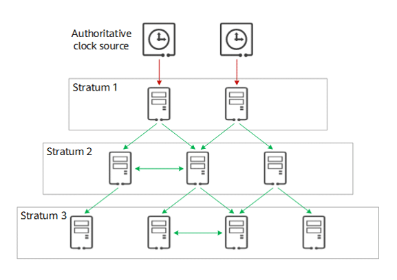
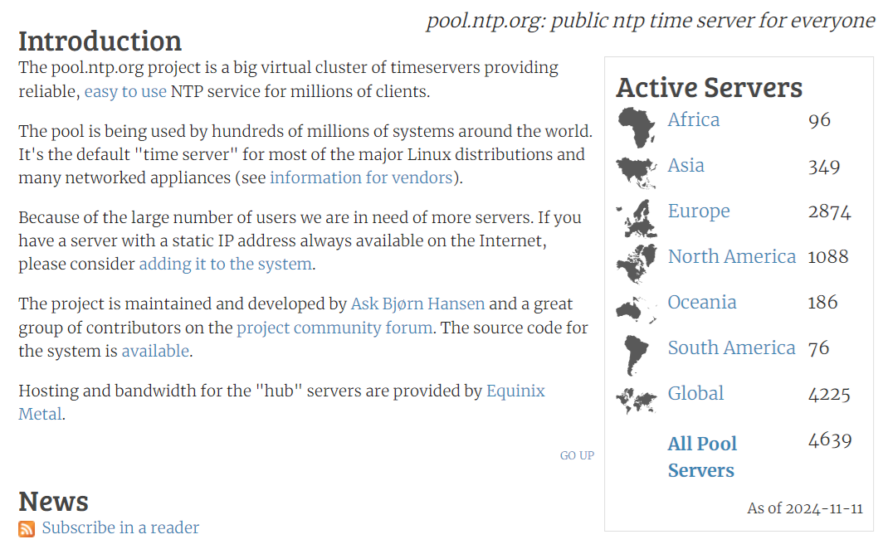

## [Как настроить дату и время в ESP32 IDE Arduino]()

ESP32 использует два аппаратных таймера для отслеживания системного времени. Системное время может отслеживаться с помощью одного или обоих аппаратных таймеров в зависимости от назначения приложения и требований к точности системного времени. 

***Таймер RTC:*** этот таймер позволяет отслеживать время в различных режимах сна, а также сохранять время при любых сбросах (за исключением сбросов при включении питания, которые сбрасывают таймер RTC). Отклонение частоты зависит от источников тактового сигнала таймера RTC и влияет на точность только в режимах сна, в этом случае время будет измеряться с разрешением 6,6667 мкс.

***Таймер с высоким разрешением:*** этот таймер недоступен в спящих режимах и не сохраняется после сброса, но обладает большей точностью. Таймер использует источник тактовых импульсов APB_CLK (обычно 80 МГц), отклонение частоты которого составляет менее ±10 частей на миллион. Время будет измеряться с точностью до 1 мкс.

> По умолчанию, для синхронизации системного времени используется комбинация обоих таймеров - RTC и высокого разрешения .

Частотную работу таймера RTC обеспечивает одно из возможных устройств: два внутренних (встроенных) и два внешних. По умолчанию используется ***Internal 150 kHz RC oscillator*** . Он обеспечивает минимальное потребление тока в режиме глубокого сна и не зависит от каких-либо внешних компонентов. Однако на стабильность частоты этого источника тактового сигнала влияют колебания температуры, поэтому время может смещаться как в режиме глубокого сна, так и в режиме лёгкого сна.

Второй внутренний таймер, который может использоваться, ***Internal 8.5 MHz oscillator, divided by 256 (about 33 kHz)***. Этот таймер обеспечивает более высокую стабильность частоты, чем Internal 150 kHz RC oscillator за счет более высокого (на 5 мкА) потребления тока в глубоком режиме сна.

И может быть подключен один из двух внешних таймеров: ***External 32 kHz crystal*** или ***External 32 kHz oscillator at 32K_XN pin***.

После включения питания ESP32 начинает отсчитывать время в секундах "с начала эпохи" - 1 января 1900 года. Для того, чтобы прочитать время таймера платы, можно воспользоваться командой - ***gettimeofday()***. Для немедленного обновления текущего времени используется функция ***settimeofday()***. 

Формат команд gettimeofday(), settimeofday() идентичный: 

```
int gettimeofday (struct timeval *tp, struct timezone *tzp);
int settimeofday (struct timeval *tp, struct timezone *tzp)
```
Функция gettimeofday() получает, а функция settimeofday() устанавливает в системе представление о текущем времени. Текущее время выражается в секундах и микросекундах, прошедших по всемирному координированному времени  с 00:00:00 (часов,минут,секунд) 1 января 1970 года. 

Аргумент ***tp*** указывает на структуру timeval, которая включает в себя следующие элементы:

```
struct timeval 
{
   long tv_sec;  /* секунды с 1 января 1970 года */
   long tv_usec; /* и микросекунды */
};
```

Аргумент ***tzp*** содержит информацию о часовом поясе. См. [TIMEZONE](https://github.com/nayarsystems/posix_tz_db/blob/master/zones.csv), но
в gettimeofday() и settimeofday() аргумент tzp игнорируется.

Если требуется узнать прошедшее время с начала эпохи с точностью до одной микросекунды, воспользуйтесь приведённым ниже фрагментом кода:

```
struct timeval tv_now;
gettimeofday(&tv_now, NULL);
int64_t time_us = (int64_t)tv_now.tv_sec * 1000000L + (int64_t)tv_now.tv_usec;
```

Если нужно получить время с точностью до секунды, используйте следующий фрагмент кода:

```
time_t now;
char strftime_buf[64];
struct tm timeinfo;

// Выбираем текущее время
time(&now);
// Устанавливаем стандартное время для региона - Европа/Москва
// https://github.com/nayarsystems/posix_tz_db/blob/master/zones.csv
setenv("TZ", "MSK-3", 1);
tzset();

localtime_r(&now, &timeinfo);
strftime(strftime_buf, sizeof(strftime_buf), "%c", &timeinfo);
printf("Текущие дата и время в Петрозаводске: %s\n", strftime_buf);

```

Так как в программном обеспечении контроллера (и в показанном фрагменте) время представляется в формате UTC, то для настройки Esp32 следует правильно установить часовой пояс. Например, для использования австралийского восточного стандартного времени (AEST) с учетом перехода на летнее время следует указать - «AEST-10AEDT,M10.1.0,M4.1.0/3».

Части этого определения часового пояса следующие:

- AEST: восточное стандартное время Австралии;
- -10: смещение UTC на 10 часов вперёд от всемирного координированного времени (UTC);
- AEDT: восточное дневное время Австралии;
- M10.1.0: переход на летнее время происходит в первое воскресенье октября;
- M4.1.0/3: переход обратно на стандартное время происходит в первое воскресенье апреля с разницей в 3 часа по сравнению с UTC.

Чтобы узнать о других определениях часовых поясов, обратитесь к [базе данных часовых поясов Posix](https://github.com/nayarsystems/posix_tz_db/blob/master/zones.csv).

Форматирование данных о текущем времени при выводе выполняется с помощью структуры данных - [struct tm](https://cplusplus.com/reference/ctime/tm/)  и по правилам для функции [strftime()](https://cplusplus.com/reference/ctime/strftime/) - format time as string.

```
 "%A, %B %d %Y %H:%M:%S" - это спецификаторы формата,  которые определяют,  как
 в struct tm timeinfo; будет отформатирован текст, а члены tm struct следующие:
  
  Тип элемента Значение                        Диапазон
  -----------------------------------------------------
  tm_sec  int  секунды после минуты            0-61*
  tm_min  int  минуты после часа               0-59
  tm_hour int  часы с полуночи                 0-23
  tm_mday int  день месяца                     1-31
  tm_mon  int  месяцы с января                 0-11
  tm_year int  годы с 1900
  tm_wday  —   количество дней с воскресенья   0-6
  tm_yday  —   количество дней с 1 января      0-365
  tm_isdst —   флаг перехода на летнее время 
```
Больше информации о функциях таймера, можно посмотреть в [руководстве по программированию системного времени для ESP32](https://docs.espressif.com/projects/esp-idf/en/v5.3.1/esp32/api-reference/system/system_time.html). 


### [How to synchronize ESP32 clock with SNTP server](https://www.makerguides.com/how-to-synchronize-esp32-clock-with-sntp-server/)

#### Как синхронизировать часы ESP32 с SNTP-сервером

В этом руководстве вы узнаете, как синхронизировать часы ESP32 с сервером SNTP, чтобы всегда иметь точное время и больше никогда не настраивать часы.

Синхронизируя часы через Интернет с сервером времени SNTP, мы можем гарантировать, что наши часы всегда будут показывать точное время, независимо от точности внутренних часов ESP32 или перехода на летнее время.

#### Сервер времени NTP

NTP расшифровывается как «протокол сетевого времени», а сервер NTP — это специализированная компьютерная система, которая предоставляет точную информацию о времени для других интернет-устройств.

Клиент NTP регулярно опрашивает один или несколько серверов NTP, чтобы получить текущее время, и синхронизирует свои внутренние часы на основе полученной метки времени. В случае с ESP32 в качестве клиента ESP32 подключается через маршрутизатор и Wi-Fi к интернету и инициирует подключение к пулу серверов NTP. Один из серверов NTP отвечает меткой времени, которую получает ESP32 и использует для настройки своих внутренних часов.


Сами серверы NTP организованы в иерархическую многоуровневую систему с высокоточными устройствами для измерения времени, такими как атомные часы, GNSS (включая GPS) или другие радиочасы (авторитетный источник времени). Отдельные уровни называются стратами.



Как правило, вы подключаетесь не к конкретному серверу NTP (IP-адресу), а к пулу из множества серверов NTP. Подробнее об этом в следующем разделе.

#### Пул NTP

Пул NTP — это динамическая коллекция сетевых серверов NTP. В следующей таблице показано количество серверов NTP в пуле ntp.org в разных географических регионах.



Однако вы также можете запрашивать время на серверах NTP в определённых местах или странах. Например, адрес «de.pool.ntp.org» относится к пулу серверов NTP в Германии (DE). Вы также можете использовать континентальные зоны, такие как Европа, Северная Америка, Океания или Азия.pool.ntp.org. Наконец, вы можете добавить числовой префикс, если вам нужно несколько имён серверов, например «0.de.pool.ntp.org», «1.de.pool.ntp.org».

#### STNP против NTP

Существует два протокола для синхронизации времени. NTP (протокол сетевого времени) и SNTP (простой протокол сетевого времени). NTP более точный и сложный, а SNTP — упрощённая версия NTP.

SNTP был специально разработан для небольших компьютеров и микроконтроллеров. Он был спроектирован с учётом более низких требований к памяти и вычислительной мощности, чем NTP. Хотя SNTP гораздо менее точен, чем NTP, он всё равно обеспечивает точность времени в пределах 100 миллисекунд.

Как правило, он используется в небольших сетевых устройствах, таких как IP-камеры, видеорегистраторы, IP-телефоны, маршрутизаторы, потребительские устройства, а также в микроконтроллерах, таких как ESP32.

#### Синхронизация часов ESP32 с SNTP-сервером

В следующем коде показано, как синхронизировать внутренние часы ESP32 со временем, полученным с сервера SNTP. Это позволяет ESP32 поддерживать точное время, периодически обновляя его с сервера.


### [System Time](https://docs.espressif.com/projects/esp-idf/en/v5.3.1/esp32/api-reference/system/system_time.html)

### [ESP-IDF System Time](https://microsin.net/programming/arm/esp-idf-system-time.html)

### [Deep Sleep Wake Stubs - заглушки для пробуждения в режиме глубокого сна](https://docs.espressif.com/projects/esp-idf/en/v5.3.1/esp32/api-guides/deep-sleep-stub.html)

### [Настенные часы с синхронизацией через интернет](https://lesson.iarduino.ru/page/ntp_esp32/)

#### [ Получение даты и времени от ESP32 в Arduino IDE (NTP-клиент)](https://diytech.ru/projects/poluchenie-daty-i-vremeni-ot-esp32-v-arduino-ide-ntp-klient)

#### [ESP32 SNTP Module using ESP-IDF – Synchronize Time with NTP](https://esp32tutorials.com/esp32-sntp-esp-idf-synchronize-time-ntp/)

Яндекс-запрос: "пример использования esp_sntp_config_t для esp32"

###### [в начало](#kvizzy)

0

1

2

3

4

5

6

7

8

9

0

1

2

3

4

5


