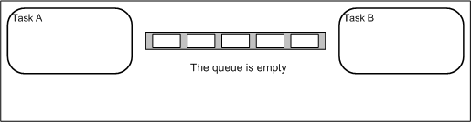

## [Как работать с очередями во FreeRTOS](https://github.com/Vladimir-Trufanov/BitofExpert/blob/main/bifeEsp32/kak-rabotat-s-ocheredyami-vo-freertos/kak-rabotat-s-ocheredyami-vo-freertos.md) [2024-11-29]

Очереди очень полезны для безопасной передачи сообщений от одной задачи к другой. Обмен сообщениями между задачами выполняется по правилу FIFO (первым сообщение пришло -  первым и уйдет), то есть новые данные добавляются в конец очереди и извлекаются из начала.

У FreeRTOS очень богатый API очередей, который предлагает большое число возможностей. 



---

### [Введение - быстрое знакомство](#%D0%B2%D0%B2%D0%B5%D0%B4%D0%B5%D0%BD%D0%B8%D0%B5)

### [xQueueCreate - coздать новую очередь](#xqueuecreate---c%D0%BE%D0%B7%D0%B4%D0%B0%D1%82%D1%8C-%D0%BD%D0%BE%D0%B2%D1%83%D1%8E-%D0%BE%D1%87%D0%B5%D1%80%D0%B5%D0%B4%D1%8C)

### [xQueueSend - пoместить элемент в очередь](#xqueuesend---%D0%BF%D0%BE%D0%BC%D0%B5%D1%81%D1%82%D0%B8%D1%82%D1%8C-%D1%8D%D0%BB%D0%B5%D0%BC%D0%B5%D0%BD%D1%82-%D0%B2-%D0%BE%D1%87%D0%B5%D1%80%D0%B5%D0%B4%D1%8C)

### [xQueueReceive - выбрать элемент из oчереди](#xqueuereceive---%D0%B2%D1%8B%D0%B1%D1%80%D0%B0%D1%82%D1%8C-%D1%8D%D0%BB%D0%B5%D0%BC%D0%B5%D0%BD%D1%82-%D0%B8%D0%B7-%D0%BE%D1%87%D0%B5%D1%80%D0%B5%D0%B4%D0%B8)

### [xQueueSendFromISR и xQueueReceiveFromISR](#xqueuesendfromisr---xqueuereceivefromisr)

### [Скетч "Передача сообщения из задачи и прерывания с приемoм в основном цикле"](#%D0%BF%D0%B5%D1%80%D0%B5%D0%B4%D0%B0%D1%87%D0%B0-%D1%81%D0%BE%D0%BE%D0%B1%D1%89%D0%B5%D0%BD%D0%B8%D1%8F-%D0%B8%D0%B7-%D0%B7%D0%B0%D0%B4%D0%B0%D1%87%D0%B8-%D0%B8-%D0%BF%D1%80%D0%B5%D1%80%D1%8B%D0%B2%D0%B0%D0%BD%D0%B8%D1%8F-%D1%81-%D0%BF%D1%80%D0%B8%D0%B5%D0%BC%D0%BE%D0%BC-%D0%B2-%D0%BE%D1%81%D0%BD%D0%BE%D0%B2%D0%BD%D0%BE%D0%BC-%D1%86%D0%B8%D0%BA%D0%BB%D0%B5)

### [Библиoграфия](#%D0%B1%D0%B8%D0%B1%D0%BB%D0%B8%D0%BE%D0%B3%D1%80%D0%B0%D1%84%D0%B8%D1%8F)

---

### [Введение](https://techtutorialsx.com/2017/08/20/esp32-arduino-freertos-queues/)

Один очень важный аспект, о котором следует помнить, заключается в том, что данные, которые помещаются в очередь, копируются, а не просто сохраняется ссылка на них. Это означает, что если мы отправим в очередь целое число, его значение будет фактически скопировано, и если мы изменим исходное значение после этого, проблем возникнуть не должно.

Тем не менее, при вызове функций с очередями следует ссылаться на данные через указатели (это особенно полезно, если сообщения для обмена большие). 

Следует также учитывать, что при вставке в заполненную очередь или извлечении из пустой очереди могут выполняться блокирующие вызовы в течение заданного периода времени (этот период времени является параметром API).

В первом, ознакомительном, примере работа с очередью из 10 целых чисел показана только в основном цикле приложения loop, для того чтобы сосредоточиться на базовых вызовах API, которые нужно выполнять.

Для работы не требуется дополнительных библиотек. При подключении к IDE Arduino плат разработки для Esp32 операционная система FreeRTOS подключается автоматически вместе с библиотекой очередей - ***queue.h***.

Таким образом, код начинается с объявления глобальной переменной типа QueueHandle_t, который нужен для ссылки на очередь FreeRTOS.

```
QueueHandle_t queue;
```

В первую очередь, в функции настройки открывается последовательный порт  для вывода результатов приложения. Далее создаётся очередь с помощью вызова функции ***xQueueCreate***. Эта функция принимает в качестве первого аргумента максимальное количество элементов, которые очередь может содержать, а в качестве второго аргумента — размер (в байтах) каждого элемента. ***Обратите внимание, что каждый элемент очереди должен иметь одинаковый размер***.

В примере создается очередь, которая может содержать максимум 10 элементов (целых чисел), где размер каждого элемента указывается в байтах с помощью функции ***sizeof***.

При успешном выполнении функция xQueueCreate вернёт дескриптор очереди, который имеет тип ***QueueHandle_t***, как и переменная, которая объявлена глобально. В случае возникновения проблем с выделением очереди будет возвращён ***NULL***. Таким образом, после проверки возвращённого результата функцией можно предупредить пользователя о возникновении проблемы.

```
void setup() 
{
   Serial.begin(115200);
   queue = xQueueCreate(10, sizeof(int));
   if (queue == NULL)
   {
      Serial.println("Error creating the queue");
   }
}
```
В начале основного цикла приложения определяется, создана ли очередь. Если все в порядке и очередь организована, то с помощью функции ***xQueueSend*** добавляются элементы в конец очереди для последующего использования.

Эта функция получает в качестве первого параметра дескриптор объявленной очереди. В качестве второго параметра она получает указатель на элемент, который следует вставить (хотя передаётся указатель, но в очередь копируется элемент), а в качестве последнего аргумента - максимальное время ожидания задачи в случае, если очередь заполнена.

Для последнего аргумента значение указывается в тиках (квантах FreeRTOS). Передача значения ***portMAX_DELAY*** означает, что ожидание будет продолжаться бесконечно, если очередь заполнена. 

Поскольку очередь может содержать максимум 10 элементов, организуется простой цикл for и на каждой итерации вставляется текущее значение.

```
for (int i = 0; i<10; i++)
{
   xQueueSend(queue, &i, portMAX_DELAY);
}
```

Обратите внимание, что всегда ***передаётся указатель на одну и ту же переменную, но поскольку её фактическое значение будет скопировано***, то нет никаких проблем с изменением её на новое значение на каждой итерации.

Аналогичный цикл используется для извлечения элементов очереди. Для того, чтобы обработать элемент, следует просто вызвать функцию ***xQueueReceive***. Она получит в качестве первого параметра дескриптор очереди, в качестве второго параметра - указатель на буфер, в который будет скопирован полученный элемент, и, наконец, количество тиков для ожидания, если очередь пуста.

Как и прежде, в качестве первого аргумента передаётся глобальная переменная - дескриптор очереди, а в качестве последнего - значение ***portMAX_DELAY***. Что касается буфера, в который копируется элемент, то перед использованием элемента объявляется переменная целочисленного типа, в которой сохраняется полученный элемент.

Следует заметить, что ***при выборке элемента он будет удалён из очереди***. Если не требуется удалять элемент при извлечении, можно использовать функцию ***xQueuePeek***.

В цикле обработки элементов их значения выводятся в последовательный порт. 

```
int element;
for (int i = 0; i<10; i++)
{
   xQueueReceive(queue, &element, portMAX_DELAY);
   Serial.print(element);
   Serial.print("|");
}
```
В завершении цикла добавляется задержка между каждой итерацией основного цикла.

### [Пример работы с очередью](QueueHandleOne/QueueHandleOne.ino)

###### [к содержанию](#%D0%B2%D0%B2%D0%B5%D0%B4%D0%B5%D0%BD%D0%B8%D0%B5---%D0%B1%D1%8B%D1%81%D1%82%D1%80%D0%BE%D0%B5-%D0%B7%D0%BD%D0%B0%D0%BA%D0%BE%D0%BC%D1%81%D1%82%D0%B2%D0%BE)

---

### [xQueueCreate - cоздать новую очередь](https://www.freertos.org/Documentation/02-Kernel/04-API-references/06-Queues/01-xQueueCreate)

Функция ***xQueueCreate*** создаёт новую очередь и возвращает дескриптор, с помощью которого можно ссылаться на эту очередь. 

```
 QueueHandle_t xQueueCreate(UBaseType_t uxQueueLength, UBaseType_t uxItemSize);
```
Перед первым использованием очередей следует просмотреть заголовочный файл ***FreeRTOSConfig.h***. Определение ***configSUPPORT_DYNAMIC_ALLOCATION*** должно быть установлено в 1 или не определено (в этом случае по умолчанию будет равно 1), чтобы эта функция RTOS API была доступна.

```
#define configSUPPORT_DYNAMIC_ALLOCATION             1
```

Для каждой очереди требуется оперативная память, которая используется для хранения состояния очереди и элементов, содержащихся в очереди (область хранения очереди). Если очередь создаётся с помощью ***xQueueCreate()***, тогда необходимая оперативная память автоматически выделяется из кучи FreeRTOS. 

Если очередь создаётся с помощью ***xQueueCreateStatic()***, то оперативная память предоставляется разработчиком приложения, что приводит к увеличению количества параметров, но позволяет выделить оперативную память статически во время компиляции. 

Параметры:

- ***uxQueueLength***, максимальное количество элементов, которое очередь может содержать одновременно;
- ***uxItemSize***, размер в байтах, необходимый для хранения каждого элемента в очереди. Элементы добавляются в очередь копированием, а не по ссылке, поэтому это количество байт, которые будут скопированы для каждого элемента в очереди. Каждый элемент в очереди должен иметь одинаковый размер.

Возврат:

если очередь создана успешно, то возвращается дескриптор созданной очереди. Если память, необходимая для создания очереди, не может быть выделена, то возвращается ***NULL***.

```
struct AMessage
{
   char ucMessageID;
   char ucData[20];
};

void vATask(void *pvParameters)
{
   QueueHandle_t xQueue1, xQueue2;
   // Создаём очередь, способную содержать до 10 чисел типа unsigned long
   xQueue1 = xQueueCreate(10, sizeof(unsigned long));
   if(xQueue1==NULL)
   {
      /* Очередь не была создана и не должна использоваться */
   }
   // Создаем очередь, способную содержать 10 структур, которые должны
   // быть помещены в очередь с помощью указателей, поскольку представляют
   // собой относительно большие данные
   xQueue2 = xQueueCreate(10, sizeof(struct AMessage));
   if( xQueue2 == NULL )
   {
      /* Очередь не была создана и не должна использоваться */
   }
   /* ... остальная часть кода задачи */
}

```

###### [к содержанию](#%D0%B2%D0%B2%D0%B5%D0%B4%D0%B5%D0%BD%D0%B8%D0%B5---%D0%B1%D1%8B%D1%81%D1%82%D1%80%D0%BE%D0%B5-%D0%B7%D0%BD%D0%B0%D0%BA%D0%BE%D0%BC%D1%81%D1%82%D0%B2%D0%BE)

---

### [xQueueSend - поместить элемент в очередь](https://www.freertos.org/Documentation/02-Kernel/04-API-references/06-Queues/03-xQueueSend)

Функция ***xQueueSend*** отправляет элемент в очередь. Хотя элемент, передаваемый в функцию, указывается как параметр по ссылке (через указатель) фактически в очередь укладывается копия элемента.

Эту функцию нельзя вызывать из подпрограммы обслуживания прерываний. Для этого используется функция ***xQueueSendFromISR()***.

Формат:

```
BaseType_t xQueueSend(QueueHandle_t xQueue,const void *pvItemToQueue,TickType_t xTicksToWait);
```

По сути это макрос, который вызывает ***xQueueGenericSend()***. Он включён для обратной совместимости с более ранними версиями FreeRTOS, в которых не было ***xQueueSendToFront()*** и ***xQueueSendToBack()***.

Параметры:

- ***xQueue***, дескриптор очереди, в которой должен быть размещен элемент;

- ***pvItemToQueue***, указатель на элемент, который необходимо поместить в очередь. Размер элементов, которые содержит очередь, должен быть определён при создании очереди, поэтому по указателю будет скопировано столько байт, каков указан размер элемента в хранилище очереди;

- ***xTicksToWait***, максимальное время, в течение которого задача должна блокироваться в ожидании освобождения места в очереди, если она уже заполнена.

Вызов функции будет повторен немедленно, если очередь заполнена, а значение параметра xTicksToWait равно 0.

Время определяется в тактовых периодах, поэтому для расчета реального времени блокировки в миллисекундах или в других единицах нужно использовать значение константа ***portTICK_PERIOD_MS***.

Если для ***INCLUDE_vTaskSuspend*** во FreeRTOSConfig.h установлено значение «1» (это по умолчанию), а время блокировки указано как p***ortMAX_DELAY***, то это приведет к блокировке задачи на неопределенный срок (без истечения времени ожидания).

Возврат:

- ***pdTRUE***, если сообщение было успешно отправлено,
- ***errQUEUE_FULL*** в противном случае.

Пример использования:
```
struct AMessage
{
   char ucMessageID;
   char ucData[20];
 } xMessage;
 
unsigned long ulVar = 10UL;

void vATask(void *pvParameters)
{
   QueueHandle_t xQueue1, xQueue2;
   struct AMessage *pxMessage;
   
   // Создаём очередь, способную содержать 10 длинных целых без знака
   xQueue1 = xQueueCreate(10, sizeof(unsigned long));
   // Создаём очередь, способную содержать 10 указателей на структуры
   // сообщений. Они должны передаваться по указателю, поскольку содержат
   // длинные строки
   xQueue2 = xQueueCreate(10, sizeof(struct AMessage *));
   
   /* ... */
   
   if(xQueue1 != 0)
   {
      // Посылаем беззнаковые целые. Ждем 10 секунд, пока освободится 
      // место, при необходимости освобождаем его
      if (xQueueSend(xQueue1, (void *) &ulVar, (TickType_t) 10) != pdPASS)
      {
         /* Не удалось отправить сообщение даже после 10 тиков */
      }
   }
   
   if (xQueue2 != 0)
   {
      // Отправляем указатель на структуру AMessage (не блокируем, если
      // очередь уже заполнена
      pxMessage = & xMessage;
      xQueueSend(xQueue2, ( void *) &pxMessage, (TickType_t) 0);
   }
   /* ... остальная часть кода задачи */
}
```
 
#### Блокировка при записи в очередь

Как и при чтении из очереди, “записывающая” задача может быть заблокирована для ожидания возможности записи в очередь. Это происходит, когда очередь полностью заполнена и в ней нет свободного места для записи нового элемента данных. До тех пор пока какая-либо другая задача не прочитает данные из очереди, задача, которая пишет в очередь, будет «ожидать», находясь в заблокированном состоянии. В одну очередь могут писать сразу несколько задач, поэтому возможна ситуация, когда несколько задач находятся в блокированном состоянии, ожидая завершения операции записи в одну очередь. Когда в очереди появится свободное место, получит управление задача с наивысшим приоритетом. В случае если запись в очередь ожидали равноприоритетные задачи, управление получит та, которая находилась в блокированном состоянии дольше остальных.

Поэтому есть, как минимум, два варианта дальнейших действий в случае, если не удаётся поместить данные в очередь мгновенно (или за некоторое время для надежности): либо отказаться от этого, либо побыстрее выбрать данные из очереди.
 
###### [к содержанию](#%D0%B2%D0%B2%D0%B5%D0%B4%D0%B5%D0%BD%D0%B8%D0%B5---%D0%B1%D1%8B%D1%81%D1%82%D1%80%D0%BE%D0%B5-%D0%B7%D0%BD%D0%B0%D0%BA%D0%BE%D0%BC%D1%81%D1%82%D0%B2%D0%BE)

---

### [xQueueReceive - выбрать элемент из очереди](https://www.freertos.org/Documentation/02-Kernel/04-API-references/06-Queues/09-xQueueReceive)

Функция ***xQueueReceive*** извлекает элемент из очереди. Элемент получается путём копирования, поэтому необходимо предоставить буфер подходящего размера. Количество байт, скопированных в буфер, должно соответствовать значению, которое было определено при создании очереди.

Эту функцию нельзя использовать в подпрограмме обслуживания прерываний, альтернативой должно служить ***xQueueReceiveFromISR***.

Формат:

```
BaseType_t xQueueReceive(QueueHandle_t xQueue,void *pvBuffer,TickType_t xTicksToWait);
```

***xQueueReceive*** - это макрос, который вызывает ***xQueueGenericReceive()***.

Параметры:

- ***xQueue*** - дескриптор очереди, из которой должен быть получен элемент;

- ***pvBuffer*** - указатель на буфер, в который будет скопирован полученный элемент;

- ***xTicksToWait*** - максимальное время, в течение которого задача должна блокироваться в ожидании поступления элемента, если очередь пуста на момент вызова. Если xTicksToWait установлен в 0, то при пустой очереди функция немедленно вернёт значение 0. 

Время ожидания определяется в тактовых периодах, поэтому для определения реального времени следует использовать в пересчете значение константы ***portTICK_PERIOD_MS***.

Если для ***INCLUDE_vTaskSuspend*** установлено значение '1' (а это по умолчанию), то время блокировки, указанное как ***portMAX_DELAY*** приведет к блокировке задачи на неопределенный срок (без истечения времени ожидания).

Возврат: ***pdTRUE***, если элемент был успешно получен из очереди, в противном случае ***pdFALSE***.

Пример использования:

```
// Определяем переменную-структуру AMessage
struct AMessage
{
   char ucMessageID;
   char ucData[20];
}  xMessage;

// Определяем очередь, которая будет использоваться для отправки 
// и получения сообщений в виде структуры типа AMessage
QueueHandle_t xStructQueue = NULL;

// Определяем очередь, которая будет использоваться для отправки
// и получения указателей на структуры
QueueHandle_t xPointerQueue = NULL;

void vCreateQueues(void) 
{
   xMessage.ucMessageID = 0xab;
   memset(&(xMessage.ucData), 0x12, 20);
   
   // Создаём очередь для отправки полных сообщений-структур. Ее также
   // можно создать и позже, но необходимо позаботиться о том, чтобы
   // очередь не использовалась до тех пор, пока она не будет создана
   xStructQueue  =  xQueueCreate(10, sizeof(xMessage));
   
   // Создаём очередь для отправки указателей на структуры AMessage
   xPointerQueue = xQueueCreate(10, sizeof(&xMessage));
   
   if ((xStructQueue == NULL) || (xPointerQueue == NULL))
   {
      // "Не удалось создать одну или несколько очередей из-за нехватки
      // доступной памяти в куче. Исправьте ошибку здесь. 
      // Очереди также могут быть созданы  статически
   }
}

// Задача, которая выполняет запись в очередь
void vATask(void *pvParameters)
{
   struct AMessage *pxPointerToxMessage;
   
   // Отправляем всю структуру в очередь, созданную для хранения 10 структур
   xQueueSend( 
      // Дескриптор очереди
      xStructQueue,
      // Адрес переменной xMessage  sizeof(struct AMessage), откуда
      // байты копируются в очередь
      (void *) &xMessage,
      // Время блокировки, равное 0, означающее, что не нужно блокировать 
      // задачу, если очередь уже заполнена. Следует проверять значение,
      // возвращаемое функцией xQueueSend(), чтобы узнать, было ли
      // сообщение успешно отправлено в очередь
      (TickType_t  0)
   );
                             
   // Сохраняем адрес переменной xMessage в переменной-указателе
   pxPointerToxMessage = &xMessage;
   
   // Отправляем адрес сообщения в очередь, созданную 
   // для хранения 10 указателей
   xQueueSend (xPointerQueue, (void *) &pxPointerToxMessage,  (TickType_t) 0);
                
   /* ... некоторая часть кода */
}

// Задача, которая выполняет чтение из очереди
void vADifferentTask(void *pvParameters)
{
   struct AMessage xRxedStructure, *pxRxedPointer;
   if (xStructQueue != NULL)
   {
      // Получаем сообщение из созданной очереди для хранения сложного
      // структурного сообщения. Блокировка на 10 тиков, если сообщение
      // недоступно немедленно. Значение считывается в структурную
      // переменную AMessage, поэтому после вызова xQueueReceive()  
      // xRxedStructure будет содержать копию сообщения
      
      if (xQueueReceive(xStructQueue, &(xRxedStructure), (TickType_t) 10) == pdPASS)
      {
         /* xRxedStructure теперь содержит копию xMessage. */
      }
   }
   
   if (xPointerQueue != NULL)
   {
      // Получаем сообщение из созданной очереди для хранения указателей.
      // Блокируем на 10 тиков, если сообщение недоступно - немедленно.
      // Значение считывается в переменную указателя, и полученное значение
      // является адресом сообщения. Переменная, после этого вызова
      // pxRxedPointer будет указывать на xMessage.
      
      if (xQueueReceive(xPointerQueue,  &(pxRxedPointer), (TickType_t) 10) == pdPASS)
      {
         /* *pxRxedPointer теперь указывает на xMessage. */
      }
   }
   /* ... остальная часть кода задачи */
}  
```

#### Блокировка задачи при чтении из очереди

Когда какая-либо задача пытается прочитать данные из очереди, которая не содержит ни одного элемента, то задача приостанавливается – то есть переходит в блокированное состояние. Приостановленная задача вернется в состояние готовности к выполнению, когда другая задача (или прерывание) поместит данные в очередь. После этого планировщик сможет передать управление ожидающей задаче (но если нет задач с более высоким приоритетом).

Выход из блокированного состояния возможен также при истечении заданного тайм-аута, даже если очередь на протяжении всего этого времени оставалась пуста. Данные из очереди могут читать сразу несколько задач. Когда очередь пуста, то все они находятся в блокированном состоянии. Когда в очереди появляется элемент данных, начнет выполняться та задача, которая имеет наибольший приоритет. Возможна ситуация, когда равноприоритетные задачи ожидают появления данных в очереди. В этом случае при поступлении
данных в очередь управление получит та задача, время ожидания которой было наибольшим. Остальные же останутся в блокированном состоянии.

Таймаут чтения из очереди позволяет реализовать механизм формирования интервалов вместо использования vTaskDelay(). В этом случае разблокировка задачи произойдет в двух случаях – либо появятся новые данные в очереди, либо истечет заданный таймаут, в зависимости от того, что наступит ранее. Таймаут можно задать равным нулю, тогда задача чтения вообще не будет блокироваться.

###### [к содержанию](#%D0%B2%D0%B2%D0%B5%D0%B4%D0%B5%D0%BD%D0%B8%D0%B5---%D0%B1%D1%8B%D1%81%D1%82%D1%80%D0%BE%D0%B5-%D0%B7%D0%BD%D0%B0%D0%BA%D0%BE%D0%BC%D1%81%D1%82%D0%B2%D0%BE)

---

### [xQueueSendFromISR - xQueueReceiveFromISR](#)

В программах обслуживания прерываний для отправки в очередь и выборки сообщений из очереди используется функции ***xQueueSendFromISR()*** и ***xQueueReceiveFromISR()***.

Эти функции очень похожи на обычные версии - xQueueSend и xQueueReceive, но имеются некоторые отличия:

отсутствует  аргумент xTicksToWait  – поскольку выполнение обработчиков прерываний должно занимать как можно меньше времени, поэтому ни о каких ожиданиях внутри прерываний и речи быть не может.

Появился новый аргумент ***pxHigherPriorityTaskWoken***. Функция может вернуть в данном аргументе два состояния - ***pdTRUE*** или ***pdFALSE***. Если вернулось pdTRUE, то это указывает, что необходимо досрочно отдать управление планировщику задач FreeRTOS. Допустим, в текущий момент выполняется задача с низким приоритетом, а высокоприоритетная ожидает сообщения из очереди и приостановлена. Далее происходит прерывание, из которого отправляется какое-либо сообщение в очередь. Но по окончании работы обработчика прерываний выполнение возвращается к текущей низкоприоритетной задаче, а высокоприоритетная все ещё ожидает, пока закончится текущий квант времени, и очередь всё ещё не обрабатывается. Однако если после этого передать управление планировщику досрочно через ***portYIELD_FROM_ISR***, то он передаст управление ожидающей высокоприоритетной задаче. Это позволяет значительно сократить время реакции системы на прерывание.


### [Передача сообщения из задачи и прерывания с приемом в основном цикле](QueueHandlMulti2/QueueHandlMulti2.ino)

В этом примере строится очередь для хранения структур в двумя полями: первое - это строка с, максимум, 256 символами; второе количество байт с символами в строке.
Прерывание вызывается по таймеру и отправляет сообщение в очередь с указанием времени в миллисекундах с момента запуска приложения.
Также в приложении периодически запускается задача, которая отправляет сообщение в очередь с указанием количества раз запуска задачи.
Все сообщения принимаются в основном цикле и передаются в последовательный порт.

Ниже представлен протокол работы приложения:

```
TASK: Очередь для структур не создана!
SETUP: Очередь сформирована!
LOOP: Не удалось принять структуру даже после 10 тиков!
LOOP: Не удалось принять структуру даже после 10 тиков!
40: Прошло 1893 миллисекунд
55: Передано 2 сообщение из задачи
40: Прошло 3293 миллисекунд
55: Передано 3 сообщение из задачи
40: Прошло 4693 миллисекунд
55: Передано 4 сообщение из задачи
40: Прошло 6093 миллисекунд
55: Передано 5 сообщение из задачи
40: Прошло 7493 миллисекунд
55: Передано 6 сообщение из задачи
40: Прошло 8893 миллисекунд
ISR: Не удалось отправить структуру!
55: Передано 7 сообщение из задачи
ISR: Не удалось отправить структуру!
41: Прошло 10293 миллисекунд
41: Прошло 11693 миллисекунд
TASK: Не удалось отправить структуру даже после 5 тиков!
55: Передано 8 сообщение из задачи
41: Прошло 13093 миллисекунд
TASK: Не удалось отправить структуру даже после 5 тиков!
55: Передано 9 сообщение из задачи
TASK: Не удалось отправить структуру даже после 5 тиков!
41: Прошло 14493 миллисекунд
TASK: Не удалось отправить структуру даже после 5 тиков!
56: Передано 10 сообщение из задачи
TASK: Не удалось отправить структуру даже после 5 тиков!
41: Прошло 15893 миллисекунд
56: Передано 11 сообщение из задачи
ISR: Не удалось отправить структуру!
56: Передано 12 сообщение из задачи
ISR: Не удалось отправить структуру!
56: Передано 13 сообщение из задачи
ISR: Не удалось отправить структуру!
41: Прошло 20093 миллисекунд
TASK: Не удалось отправить структуру даже после 5 тиков!
41: Прошло 21493 миллисекунд
41: Прошло 22893 миллисекунд
...
```

### Библиография

#### [Queue Management](https://www.freertos.org/Documentation/02-Kernel/04-API-references/06-Queues/00-QueueManagement)

#### [FreeRTOS queues](https://www.freertos.org/Documentation/02-Kernel/02-Kernel-features/02-Queues-mutexes-and-semaphores/01-Queues)

#### [Очереди FreeRTOS](https://kotyara12.ru/iot/esp32_queue/)

#### [ESP32 Arduino: FreeRTOS Queues](https://techtutorialsx.com/2017/08/20/esp32-arduino-freertos-queues/)

###### [к содержанию](#%D0%B2%D0%B2%D0%B5%D0%B4%D0%B5%D0%BD%D0%B8%D0%B5---%D0%B1%D1%8B%D1%81%D1%82%D1%80%D0%BE%D0%B5-%D0%B7%D0%BD%D0%B0%D0%BA%D0%BE%D0%BC%D1%81%D1%82%D0%B2%D0%BE)
