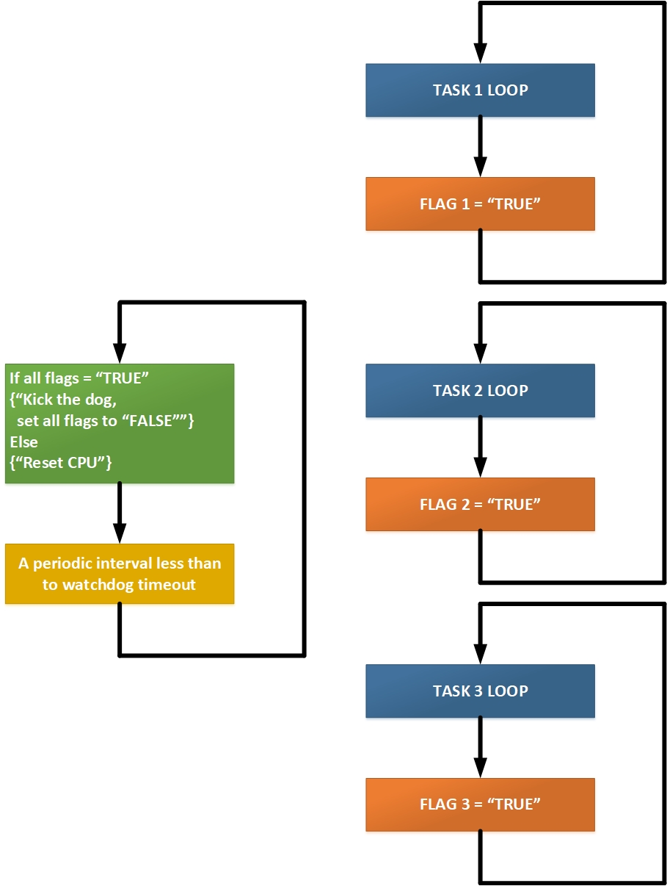

## [Обнаружение блокировки ESP32 с помощью внутреннего сторожевого таймера](https://github.com/Vladimir-Trufanov/BitofExpert/blob/main/bifeEsp32/obnaruzhenie-blokirovki-esp32-s-pomoshchyu-storozhevogo-tajmera/obnaruzhenie-blokirovki-esp32-s-pomoshchyu-storozhevogo-tajmera.md) [2024-11-04]

### I. Введение

В материале представлен перевод github-репозитария [https://github.com/TronixLab/ESP32_Watchdog?tab=readme-ov-file](https://github.com/TronixLab/ESP32_Watchdog?tab=readme-ov-file).

> Все примеры реализованы для плат ESP32 в версии библиотеки от Espressif Systems версии 3.0.6 и проверены на контроллере AI-Thinker ESP32-CAM.

Если ваша программа по какой-либо причине зависает, самый быстрый способ восстановления - перезагрузить компьютер. Одним из наиболее известных примеров был фатальный сбой операционной системы Windows и отображение синего экрана смерти (BSoD), после чего компьютер перезагружался, чтобы избежать дальнейшего повреждения. 

В отличие от настольных компьютеров, встроенные устройства должны быть автономными. Что делать, если вы не можете перезагрузить компьютер физически? Если программа зависает, не всегда возможно дождаться, пока кто-нибудь eё перезагрузит. Некоторые встроенные устройства, такие как космические зонды, просто недоступны для людей, и ручной сброс невозможен; они могут стать необратимо отключенными, если не смогут автономно восстанавливаться после сбоев. 

В таких ситуациях сторожевой таймер Watchdog почти единственный способ спасти положение. 

### II. Что такое сторожевой таймер?

Сторожевой таймер (WDT) - это аппаратный или программный таймер, который может использоваться для автоматического обнаружения программных аномалий и автоматической генерации сброса системы, если основная программа пренебрегает его периодическим обслуживанием. 

Он часто используется для автоматического сброса встроенного устройства, зависшего из-за программного или аппаратного сбоя. 

> ***Сторожевой таймер основан на счетчике, который ведет обратный отсчет от некоторого начального значения до нуля. Встроенное программное обеспечение выбирает начальное значение счетчика и периодически перезапускает его. Если счетчик когда-либо достигает нуля до того, как программное обеспечение перезапустит его, предполагается, что программное обеспечение неисправно, и устанавливается сигнал сброса процессора.***

Процесс перезапуска счетчика (сброса) сторожевого таймера иногда называют словосочетанием ***“пинать собаку”***. Подходящей визуальной метафорой является изображение человека, на которого нападает злобная собака. Если он продолжает пинать собаку, она никогда не сможет его укусить. Но он должен продолжать пинать собаку через равные промежутки времени, чтобы избежать укуса. 

Аналогично, программное обеспечение должно регулярно перезапускать (сбрасывать) сторожевой таймер, иначе возникает риск перезапуска. Другой термин для обозначения “пинка” - это ***"подача сторожевого таймера"***. На сторожевой таймер непрерывно подается начальное значение, так что значение таймера никогда не может достичь нуля.


На [рис.1](#) показано типичное расположение сторожевого таймера как внешнего блока по отношению к процессору. Однако он также может быть встроен в тот же чип, что и центральный процессор. Это делается во многих микроконтроллерах. В любом случае выходной сигнал сторожевого таймера напрямую связан с сигналом сброса процессора.

#### [Учебный пример таймера сторожевого механизма](ex3-0-6-0-Watchdog/ex3-0-6-0-Watchdog.ino)

#### [Скетч "Базовый сторожевой таймер"](ex3-0-6-1-BasicWDT/ex3-0-6-1-BasicWDT.ino)

### III. Каковы потенциальные причины события зависания?

Выход из строя микроконтроллера - MCU, как неисправность железа, так и неучтеные ситуации в программном коде могут привести к полной остановке работы. Это может доставить неудобства пользователям или создать угрозу функциональной безопасности в критически важных приложениях. 

Механизм безопасности чрезвычайно важен. Надежная встраиваемая система требует совместных усилий разработчика оборудования и программиста встроенного программного обеспечения. Существуют аппаратные и программные факторы, из-за которых MCU может отказать:

- электрический шум может вызвать сбой питания и повредить часть программного обеспечения;
- нестабильный источник питания;
- переполнение стека памяти;
- отсутствие ответа на запрос у аппаратного компонента;
- обратная ЭДС, электромагнитные помехи, электростатический разряд, космические лучи и т.д.;
- состояние мертвой блокировки;
- множественные прерывания основного цикла.

!!! В следующем примере показано зависание -  явление, при котором две задачи находятся в заблокированном состоянии, одновременно ожидая доступа к ресурсам, которые удерживаются одной из них. 

!!! Во FreeRTOS нет решения проблемы зависания. При использовании этой операционной системы реального времени такого зависания можно избежать только путём тщательного программирования приложений. Следует составлять задачи таким образом, чтобы не возникало взаимоблокировки.

> ***Замечание от 2024-11-04: на сегодня, в версии библиотеки от Espressif Systems версии 3.0.6 и по итогам проверки на контроллере AI-Thinker ESP32-CAM проблема взаимоблокировки во  FreeRTOS разрешается, а сторожевой таймер при необходимости перезагружает контроллер!***

#### [Скетч "Взаимоблокировка"](ex3-0-6-2-DeadLockWDT/ex3-0-6-2-DeadLockWDT.ino)

### IV. Структура кода со сторожевым таймером

Если "пинать собаку через равные промежутки времени, это доказывает, что программное обеспечение работает. Конечно полезно пинать собаку только в том случае, если система проходит проверку работоспособности, как показано на рис.2:

основной цикл программы выполняет некоторые полезные действия, кроме этого, загружает начальным значением (тайм-аутом) сторожевой таймер. Тайм-аут превышает максимальное время выполнения основного цикла программы.

Каждый раз, когда основной цикл выполняется, код сбрасывает сторожевой таймер («пинает» или «кормит» собаку). Если возникает ошибка и основная программа не возвращается для сброса таймера до того, как он обнулится, то генерируется прерывание для сброса процессора. 

При таком использовании сторожевой таймер может обнаруживать ошибки в программе Arduino, работающей без присмотра, и предпринимать корректирующие действия. 


В некоторых случаях перед тем, как запустить сторожевой таймер, следует выделить некоторые буферы или проверить состояние какого-либо компонента. Грамотное проектирование таких проверок увеличит количество ошибок, которые сможет обнаружить сторожевой таймер. Один из подходов заключается в том, чтобы очищать некоторые флаги перед запуском каждого цикла, как показано на рис.3.


Каждый флаг устанавливается в определённой точке цикла. В конце цикла собаку пинают, но сначала проверяют флаги, чтобы убедиться, что все важные точки цикла были посещены. 

В следующем скетче в основном цикле выполняются три деятельности. Каждая деятельность после своей работы устанавливает соответствующий флаг. В завершении цикла,  в контрольном блоке проверяются все три флага. Если все флаги установлены,  то они сбрасываются в ноль и счетчик сторожевого таймера запускается снова.

В скетч включена имитация зацикливания. Если в последовательный порт с компьютера вводится целое число 1, то запускается бесконечный цикл, который через некоторое время заставляет сторожевой таймер перезагрузить контроллер.

#### [Скетч "Проверка работоспособности в одном цикле"](ex3-0-6-3-SanityCheckSingleLoop/ex3-0-6-3-SanityCheckSingleLoop.ino)

В программном коде, требующем многозадачности, как показано на рис.4 (в частности, работающем под управлением операционной системы реального времени - RTOS) для сторожевого таймера используется отдельная задача. Эта задача просыпается через регулярные промежутки времени и проверяет работоспособность всех остальных задач в системе. Если все задачи проходят проверку, запускается сторожевой таймер. Задача сторожевого таймера работает с более высоким приоритетом, чем задачи, которые она отслеживает.



Тайм-аут сторожевого таймера выбирается таким образом, чтобы он был максимальным временем, в течение которого все контролируемые задачи успевали бы выполнить полный цикл от начальной точки до конечной. Каждой задаче ставится в соответствие флаг, который может принимать два значения: TRUE или FALSE. 

Позже флаг считывается и записывается монитором. Задача монитора — проснуться до истечения тайм-аута сторожевого таймера и проверить состояние каждого флага. Если все флаги содержат значения TRUE, это значит, что каждая задача получила возможность выполнить свою часть работы, и сторожевой таймер может быть запущен. Причём некоторые задачи могли выполнить несколько циклов и несколько раз установить свой флаг в TRUE, что допустимо. После запуска сторожевого таймера монитор устанавливает все флаги в FALSE. К моменту повторного запуска задачи монитора все флаги FALSE должны быть перезаписаны на TRUE.

#### [Скетч "Проверка работоспособности нескольких задач"](ex3-0-6-4-SanityCheckRTOS/ex3-0-6-4-SanityCheckRTOS.ino)

### V. "Всеобъемлющий сторожевой пес"

WDT является последней линией защиты, его конструкция должна предусматривать любой возможный сбой. 

Основные характеристики надёжного сторожевого устройства:

```
WDT должен быть независимым от центрального процессора;
WDT должен всегда, при любых условиях, за исключением, возможно, аппаратного сбоя, возвращать систему к жизни.
-------------------------------------------------------
Как вариант, некоторые WDT выдают не маскируемое прерывание (NMI) вместо сброса.
```
В следующем примере, сторожевой таймер - "всеобъемлющий сторожевой пес" обслуживает четыре задачи и вызывает перезагрузку контроллера, когда зацикливаются любая из задач. Сторожевой таймер реализован, как обработчик прерывания по таймеру.

Две задачи загружены на нулевое ядро контроллера, две другие на первое. Все контролируемые задачи после успешного завершения цикла выставляют свой флаг в 1. Обработчик сторожевого таймера содержит критическую секцию, в которой проверяет состояния флагов всех задач. Если все флаги говорят об успешном выполнении задач, то обработчик сбрасывает их в 0 и перезапускает сторожевой счётчик.

Искусственно любую задачу можно зациклить. Для этого в основном цикле считываются целые числа из последовательного порта, что позволяет ввести и числа 1, 2, 3, 4. Введенные числа проверяются задачами на соответствие своим номерам и, следовательно, запуску бесконечного цикла.

При зацикливании, флаг задачи сброшенный сторожевым обработчиком не устанавливается в 1, что затем вызывает перезагрузку контроллера.

#### [Скетч "Всеобъемлющий сторожевой пес"](ex3-0-6-5-GreatWDT/ex3-0-6-5-GreatWDT.ino)

### Библиография

#### [Watchdogs Esp32 - документация Espressif 5.3.1](https://docs.espressif.com/projects/esp-idf/en/v5.3.1/esp32/api-reference/system/wdts.html) 

###### [в начало](#i.-%D0%B2%D0%B2%D0%B5%D0%B4%D0%B5%D0%BD%D0%B8%D0%B5)
