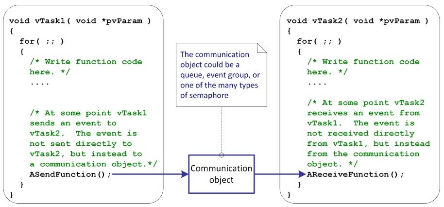
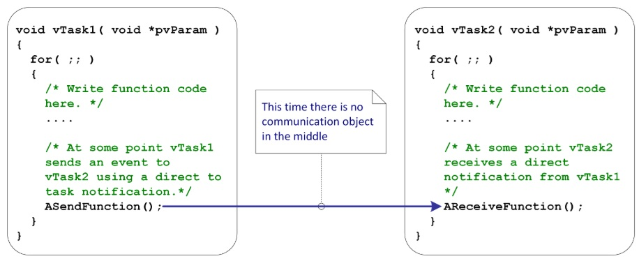

## [Оповещение задачи вместо семафора и очереди](https://github.com/Vladimir-Trufanov/BitofExpert/blob/main/bifeEsp32/opoveshchenie-zadachi-vmesto-semafora-i-ocheredi/opoveshchenie-zadachi-vmesto-semafora-i-ocheredi.md) [2025-02-09]

Очереди и семафоры - это базовые функции, предоставляемые всеми операционными системами. Разработчики, впервые использующие FreeRTOS, применяют их, потому что они им знакомы. Однако в большинстве случаев ***прямые уведомления о задачах FreeRTOS*** обеспечивают более компактную и на 45% более быструю альтернативу семафорам, а ***буферы сообщений и потоковые буферы FreeRTOS*** обеспечивают более компактную и быструю альтернативу очередям.

> Ричард Барри основал проект FreeRTOS в 2003 году, более десяти лет занимался разработкой и продвижением FreeRTOS в своей компании Real Time Engineers Ltd, а сейчас продолжает работать над FreeRTOS в составе большой команды в качестве главного инженера в Amazon Web Services.

### [Предыстория oт Ричарда Барри](#%D0%BF%D1%80%D0%B5%D0%B4%D1%8B%D1%81%D1%82%D0%BE%D1%80%D0%B8%D1%8F-%D0%BE%D1%82-%D1%80%D0%B8%D1%87%D0%B0%D1%80%D0%B4%D0%B0-%D0%B1%D0%B0%D1%80%D1%80%D0%B8)

### [Как узнать версию FreeRTОS](#%D0%BA%D0%B0%D0%BA-%D1%83%D0%B7%D0%BD%D0%B0%D1%82%D1%8C-%D0%B2%D0%B5%D1%80%D1%81%D0%B8%D1%8E-freertos)

### [Семафорные функции чeрез уведомления](#%D1%81%D0%B5%D0%BC%D0%B0%D1%84%D0%BE%D1%80%D0%BD%D1%8B%D0%B5-%D1%84%D1%83%D0%BD%D0%BA%D1%86%D0%B8%D0%B8-%D1%87%D0%B5%D1%80%D0%B5%D0%B7-%D1%83%D0%B2%D0%B5%D0%B4%D0%BE%D0%BC%D0%BB%D0%B5%D0%BD%D0%B8%D1%8F)

### [Пример использования уведомления для синхрoнизации прерывания с задачей](#%D0%BF%D1%80%D0%B8%D0%BC%D0%B5%D1%80-%D0%B8%D1%81%D0%BF%D0%BE%D0%BB%D1%8C%D0%B7%D0%BE%D0%B2%D0%B0%D0%BD%D0%B8%D1%8F-%D1%83%D0%B2%D0%B5%D0%B4%D0%BE%D0%BC%D0%BB%D0%B5%D0%BD%D0%B8%D1%8F-%D0%B4%D0%BB%D1%8F-%D1%81%D0%B8%D0%BD%D1%85%D1%80%D0%BE%D0%BD%D0%B8%D0%B7%D0%B0%D1%86%D0%B8%D0%B8-%D0%BF%D1%80%D0%B5%D1%80%D1%8B%D0%B2%D0%B0%D0%BD%D0%B8%D1%8F-%D1%81-%D0%B7%D0%B0%D0%B4%D0%B0%D1%87%D0%B5%D0%B9)

### [Передача величин uint32_t через уведомления](#)

Каждая задача RTOS имеет массив уведомлений о задачах. Каждое уведомление о задаче может находиться в одном из двух состояний: "ожидание" или "не ожидание", а также имеет 32-битное значение уведомления. Константа ***configTASK_NOTIFICATION_ARRAY_ENTRIES*** в файле конфигурации FreeRTOS  ***FreeRTOSConfig.h*** устанавливает количество индексов в массиве уведомлений о задачах. До версии FreeRTOS V10.4.0 задачи имели только одно уведомление, а не массив уведомлений.

> Оповещения задач осуществляются через ***DMA*** следующим образом:  задача RTOS вызывает передающую функцию, затем ждёт в блокированном состоянии (не потребляя время CPU), пока не получит оповещение о завершении передачи. Передача происходит под управлением DMA, а прерывание завершения DMA используется для оповещения задачи.
 
>  Для отправки оповещений используются API-вызовы группы ***TaskNotify*** или ***TaskNotifyGive***. Оповещения остаются в состоянии ожидания, пока принимающая задача не вызовет их по ***TaskNotifyWait*** или ***TaskNotifyTake***.

Прямое уведомление о задаче — это событие, отправляемое непосредственно задаче, а не косвенно через промежуточный объект, такой как очередь, группа событий или семафор. При отправке прямого уведомления о задаче состояние уведомления в принимающей задаче устанавливается в «ожидание». Точно так же, как задача может блокироваться на промежуточном объекте, таком как семафор, в ожидании доступности этого семафора, задача может блокироваться на уведомлении о задаче в ожидании перехода этого уведомления в состояние ожидания.

При отправке прямого уведомления о задаче в задачу можно дополнительно обновить его значение на приёме одним из следующих способов:

- перезаписать значение независимо от того, прочитало ли его получающее задание;

- перезаписать значение, но только если получающая задача прочитала перезаписываемое значение;

- установить один или несколько битов в значении;

- увеличить (добавить единицу) значение.

Вызов ***xTaskNotifyWait()/xTaskNotifyWaitIndexed()*** для считывания значения уведомления приводит к тому, что состояние уведомления становится равным ***не ожидающее***. Состояние уведомления также можно явно установить равным ***не ожидающее*** с помощью вызова ***xTaskNotifyStateClear()/xTaskNotifyStateClearIndexed()***.

Примечание: каждое уведомление в массиве работает независимо - задача может быть заблокирована только одним уведомлением в массиве за раз и не будет разблокирована уведомлением, отправленным в любой другой индекс массива.

Функция уведомлений о задачах RTOS включена по умолчанию и может быть исключена из сборки (для экономии 5 байт на индекс массива для каждой задачи) путем установки ***configUSE_TASK_NOTIFICATIONS*** в значение ***0*** в ***FreeRTOSConfig.h***.

> ВАЖНОЕ ПРИМЕЧАНИЕ: для буферов потоков и сообщений FreeRTOS  использует уведомление о задаче по индексу массива 0. Если требуется сохранить состояние уведомления о задаче при вызове функции API буфера потока или сообщения, следует использовать уведомление о задаче по индексу массива больше 0.

Гибкость уведомлений о задачах позволяет использовать их там, где в противном случае пришлось бы создавать отдельную очередь, двоичный семафор, счетный семафор или группу событий. Разблокировка задачи RTOS с помощью прямого уведомления выполняется на 45% быстрее и требует меньше оперативной памяти, чем разблокировка задачи с помощью промежуточного объекта. 

Как и следовало ожидать, эти преимущества в производительности требуют некоторых ограничений в использовании:

уведомления о задачах RTOS можно использовать только в том случае, если существует только одна задача, которая может быть получателем события. Однако это условие выполняется в большинстве реальных случаев использования, например, при прерывании, разблокирующем задачу, которая будет обрабатывать данные, полученные в результате прерывания.

###### [к содержанию](#%D0%BF%D1%80%D0%B5%D0%B4%D1%8B%D1%81%D1%82%D0%BE%D1%80%D0%B8%D1%8F-o%D1%82-%D1%80%D0%B8%D1%87%D0%B0%D1%80%D0%B4%D0%B0-%D0%B1%D0%B0%D1%80%D1%80%D0%B8)

---

### Предыстория от Ричарда Барри

"*В FreeRTOS, выпущенной в 2002 году, была добавлена функция семафоров за счёт реализации API семафоров в виде набора макросов, которые вызывают API очередей. Преимущество такого подхода заключалось в том, что функция семафоров была добавлена без увеличения размера кода (что было важно, когда объём флэш-памяти обычно был меньше, чем сегодня), но недостатком было то, что семафоры были нетипично тяжёлыми объектами, поскольку они наследовали все функции очереди*.

*Например, очереди по-настоящему учитывают потоки и приоритеты, включают в себя механизм событий и упорядоченные по приоритету списки задач, ожидающих отправки в очередь и получения из очереди. В некоторых случаях использования семафоров эта комплексная функциональность полезна, но в большинстве случаев она не требуется*. 

*Поэтому, когда мы искали простой механизм событий для использования в библиотеках драйверов, мы решили не переписывать код семафоров, а создать новый примитив, специально предназначенный для этих наиболее распространённых случаев использования. Этот примитив* - ***прямые уведомления о задачах*** - *с этого момента будет называться просто **уведомления***".

#### Что такое непосредственное уведомления о задаче?

Большинство методов межзадачной связи проходят через промежуточные объекты, такие как ***очередь, семафор или группа событий***. Отправляющая задача записывает данные в объект связи, а принимающая задача считывает данные из объекта связи. При использовании прямого уведомления о задаче, как следует из названия, отправляющая задача отправляет уведомление непосредственно принимающей задаче без использования промежуточного объекта.





Начиная с FreeRTOS V10.4.0, каждая задача имеет массив уведомлений. До этого у каждой задачи было по одному уведомлению. Каждое уведомление состоит из 32-битного значения и логического состояния, которые вместе занимают всего 5 байт оперативной памяти.

Точно так же, как задача может блокироваться на двоичном семафоре в ожидании, пока этот семафор станет «доступным», задача может блокироваться на уведомлении в ожидании, пока состояние этого уведомления «ожидающее». Точно так же, как задача может блокироваться на счётном семафоре в ожидании, пока счёт этого семафора ненулевой, задача может блокироваться на уведомлении в ожидании, пока значение этого уведомления ненулевое.

###### [к содержанию](#%D0%BF%D1%80%D0%B5%D0%B4%D1%8B%D1%81%D1%82%D0%BE%D1%80%D0%B8%D1%8F-o%D1%82-%D1%80%D0%B8%D1%87%D0%B0%D1%80%D0%B4%D0%B0-%D0%B1%D0%B0%D1%80%D1%80%D0%B8)

---

### Как узнать версию FreeRTOS

Узнать версию FreeRTOS можно по определениям, доступным в файле ***task.h***. Они определяют версию ядра по следующим параметрам: tskKERNEL_VERSION_NUMBER (версия ядра), tskKERNEL_VERSION_MAJOR (основная версия), tskKERNEL_VERSION_MINOR (минорная версия), tskKERNEL_VERSION_BUILD (версия сборки).

```
#include "task.h"

/*-----------------------------------------------------------
 * MACROS AND DEFINITIONS
 *----------------------------------------------------------*/

#define tskKERNEL_VERSION_NUMBER       "V10.4.3"
#define tskKERNEL_VERSION_MAJOR        10
#define tskKERNEL_VERSION_MINOR        4
#define tskKERNEL_VERSION_BUILD        3
```

###### [к содержанию](#%D0%BF%D1%80%D0%B5%D0%B4%D1%8B%D1%81%D1%82%D0%BE%D1%80%D0%B8%D1%8F-o%D1%82-%D1%80%D0%B8%D1%87%D0%B0%D1%80%D0%B4%D0%B0-%D0%B1%D0%B0%D1%80%D1%80%D0%B8)

---

### Семафорные функции через уведомления

#### xTaskNotifyGive, xTaskNotifyGiveIndexed

task.h
```
BaseType_t xTaskNotifyGive(TaskHandle_t xTaskToNotify);

BaseType_t xTaskNotifyGiveIndexed(TaskHandle_t xTaskToNotify, UBaseType_t uxIndexToNotify);
```

***xTaskNotifyGive()*** - это макрос, когда уведомление о задаче используется в качестве облегченной и более быстрой альтернативы двоичному коду или счетному семафору. Семафоры FreeRTOS задаются с помощью API-функции xSemaphoreGive(). xTaskNotifyGive() - это эквивалент, который использует одно из значений уведомления принимающей задачи RTOS вместо семафора.

xTaskNotifyGive() и xTaskNotifyGiveIndexed() - это эквивалентные макросы. Разница лишь в том, что xTaskNotifyGiveIndexed() может работать с любым уведомлением о задаче в массиве, а xTaskNotifyGive() всегда работает с уведомлением о задаче по индексу 0 в массиве.

Если значение уведомления о задаче используется в качестве эквивалента двоичного или счётного семафора, то задача, получающая уведомление, должна ожидать уведомления с помощью функции ***ulTaskNotifyTake()*** API.

Примечание: каждое уведомление в массиве работает независимо - задача может быть заблокирована только одним уведомлением в массиве и не будет разблокирована уведомлением, отправленным в любой другой индекс массива.

Функция xTaskNotifyGive() не должна вызываться из подпрограммы обработки прерываний. Вместо этого используйте ***vTaskNotifyGiveFromISR()***.

configUSE_TASK_NOTIFICATIONS должно быть равно 1 в FreeRTOSConfig.h (или не определён), чтобы эти макросы были доступны. Константа configTASK_NOTIFICATION_ARRAY_ENTRIES задает количество индексов в массиве уведомлений каждой задачи.

До FreeRTOS V10.4.0 у каждой задачи было одно «значение уведомления», и все функции API уведомлений задач работали с этим значением. Замена одного значения уведомления массивом значений уведомлений потребовала создания нового набора функций API, которые могли бы обращаться к конкретным уведомлениям в массиве. xTaskNotifyGive() — это исходная функция API, которая остаётся обратно совместимой, всегда работая со значением уведомления по индексу 0 в массиве. Вызов xTaskNotifyGive() эквивалентен вызову xTaskNotifyGiveIndexed() с параметром uxIndexToNotify, равным 0.

***Параметры:***

- ***xTaskToNotify***, дескриптор (заголовок) задачи, получающей уведомления. Данный дескриптор определяется при создании задачи с помощью xTaskCreate() параметром pxCreatedTask или возвращается при создании задачи с помощью xTaskCreateStatic(). Также заголовок может быть получен при вызове xTaskGetHandle(). Обработчик выполняемой в данный момент задачи RTOS возвращается функцией ***xTaskGetCurrentTaskHandle()*** API;

- ***uxIndexToNotify***, индекс в массиве значений уведомлений целевой задачи, на который должно быть отправлено уведомление. uxIndexToNotify должен быть меньше, чем configTASK_NOTIFICATION_ARRAY_ENTRIES. Функция xTaskNotifyGive() не имеет этого параметра и всегда отправляет уведомления на индекс 0.

#### vTaskNotifyGiveFromISR, vTaskNotifyGiveIndexedFromISR

task.h
```
void vTaskNotifyGiveFromISR(
   TaskHandle_t xTaskToNotify, 
   BaseType_t *pxHigherPriorityTaskWoken);

void vTaskNotifyGiveIndexedFromISR(
   TaskHandle_t xTaskHandle, 
   UBaseType_t uxIndexToNotify,
   BaseType_t *pxHigherPriorityTaskWoken);
```
Это версии xTaskNotifyGive() и xTaskNotifyGiveIndexed(), которые нужно использовать из подпрограмм обслуживания прерываний (ISR). 

***Параметры:***

- ***xTaskToNotify***, дескриптор (заголовок) задачи, получающей уведомления. Данный дескриптор определяется при создании задачи с помощью xTaskCreate() параметром pxCreatedTask или возвращается при создании задачи с помощью xTaskCreateStatic(). Также заголовок может быть получен при вызове xTaskGetHandle(). Обработчик выполняемой в данный момент задачи RTOS возвращается функцией ***xTaskGetCurrentTaskHandle()*** API;

- ***uxIndexToNotify***, индекс в массиве значений уведомлений целевой задачи, на который должно быть отправлено уведомление. uxIndexToNotify должен быть меньше, чем configTASK_NOTIFICATION_ARRAY_ENTRIES. Функция vTaskNotifyGiveFromISR() не имеет этого параметра и всегда отправляет уведомления на индекс 0;

- ***pxHigherPriorityTaskWoken***: *pxHigherPriorityTaskWoken должен быть инициализирован pdFALSE. vTaskNotifyGiveFromISR() установит *pxHigherPriorityTaskWoken в
значение pdTRUE, если отправка уведомления привела к разблокировке задачи, а у разблокированной задачи приоритет выше, чем у текущей запущенной задачи. Если vTaskNotifyGiveFromISR()  устанавливает это значение в pdTRUE, то после этого перед завершением прерывания следует запросить переключение контекста - portYIELD_FROM_ISR(xHigherPriorityTaskWoken. pxHigherPriorityTaskWoken
является необязательным параметром и может иметь значение NULL.

#### ulTaskNotifyTake, ulTaskNotifyTakeIndexed

task.h
```
uint32_t ulTaskNotifyTake( 
   BaseType_t xClearCountOnExit,
   TickType_t xTicksToWait
);
   
uint32_t ulTaskNotifyTakeIndexed(
   UBaseType_t uxIndexToWaitOn, 
   BaseType_t xClearCountOnExit,
   TickType_t xTicksToWait 
);
```

Значение уведомления, напрямую  поступающее в задачу может быть изменено принимающей задачей несколькими различными способами. Например, уведомление может перезаписать одно из значений или просто установить один или несколько битов в одном из значений уведомления в принимающей задаче.

***ulTaskNotifyTake()*** является макросом, предназначенным для использования в качестве более быстрой и легковесной альтернативы двоичному коду или счетному семафору. Семафоры FreeRTOS берутся с помощью xSemaphoreTake(). Функция API ulTaskNotifyTake() это эквивалент, который использует значение уведомления вместо семафора.

ulTaskNotifyTake() и ulTaskNotifyTakeIndexed() являются эквивалентными макросами - с той лишь разницей, что ulTaskNotifyTakeIndexed() может работать с любым уведомлением о задаче внутри массива, а ulTaskNotifyTake() всегда работает с уведомлением о задаче с индексом массива 0.

Когда задача использует значение уведомления в качестве двоичного или счётного семафора, другие задачи и прерывания должны отправлять ей уведомления с помощью макроса xTaskNotifyGive() или функции ***xTaskNotify()*** с параметром ***eAction***, установленным в ***eIncrement*** (эти два варианта эквивалентны).

ulTaskNotifyTake() может либо обнулить значение уведомления задачи при выходе, и в этом случае значение уведомления действует как двоичный семафор, либо уменьшить значение уведомления задачи при выходе, и в этом случае значение уведомления действует больше как счетный семафор.

Задача RTOS использует ulTaskNotifyTake() для блокирования в ожидании значения уведомления о задаче. Это действие не потребляет процессорного времени, пока задача находится в заблокированном состоянии.

Примечание: каждое уведомление в массиве работает независимо — задача может быть заблокирована только одним уведомлением в массиве и не будет разблокирована уведомлением, отправленным в любой другой индекс массива.

configUSE_TASK_NOTIFICATIONS должен быть равно 1 в FreeRTOSConfig.h (или не определён), чтобы эти макросы были доступны. Константа configTASK_NOTIFICATION_ARRAY_ENTRIES задает количество индексов в массиве уведомлений каждой задачи.

До FreeRTOS версии 10.4.0 каждая задача имела единственное "значение уведомления" и все функции API уведомлений о задачах работали с этим значением. Замена одного значения уведомления массивом значений уведомлений потребовала создания нового набора функций API, которые могли бы обращаться к конкретным уведомлениям внутри массива. ulTaskNotifyTake() остаётся обратно совместимой, всегда работая со значением уведомления по индексу 0 в массиве. Вызов ulTaskNotifyTake() эквивалентен вызову ulTaskNotifyTakeIndexed() с помощью uxIndexToWaitOn равным 0.

***Параметры:***

- ***uxIndexToWaitOn*** - индекс в массиве значений уведомлений вызывающей задачи, по которому вызывающая задача будет ожидать ненулевого значения уведомления. uxIndexToWaitOn должен быть меньше, чем - configTASK_NOTIFICATION_ARRAY_ENTRIES. ulTaskNotifyTake() не имеет этого параметра и всегда ожидает уведомлений по индексу 0;

- ***xClearCountOnExit*** - если получено уведомление о задаче RTOS и для параметра xClearCountOnExit установлено значение pdFALSE, то значение уведомления задачи RTOS уменьшается перед завершением работы 
ulTaskNotifyTake(). Это эквивалентно уменьшению значения счетного семафора при успешном вызове функции xSemaphoreTake().

Если получено уведомление о задаче RTOS и для параметра xClearCountOnExit установлено значение pdTRUE, то значение уведомления задачи RTOS сбрасывается на 0 перед завершением работы ulTaskNotifyTake(). Это эквивалентно тому, что значение двоичного семафора становится равным нулю (или пустым, или "недоступным") после успешного вызова функции xSemaphoreTake();

- ***xTicksToWait*** - максимальное время ожидания получения уведомления в заблокированном состоянии, если уведомление еще не находится на рассмотрении функции ulTaskNotifyTake(). Задача RTOS не потребляет процессорное время, когда находится в заблокированном состоянии. Время указывается в тактовых периодах RTOS. ***pdMS_TO_TICKS()*** - этот макрос можно использовать для преобразования времени, указанного в миллисекундах, во время, указанное в тиках.

***Возврат:***

Значение уведомления о задаче до его уменьшения или очистки.

###### [к содержанию](#%D0%BF%D1%80%D0%B5%D0%B4%D1%8B%D1%81%D1%82%D0%BE%D1%80%D0%B8%D1%8F-o%D1%82-%D1%80%D0%B8%D1%87%D0%B0%D1%80%D0%B4%D0%B0-%D0%B1%D0%B0%D1%80%D1%80%D0%B8)

---

### Пример использования уведомления для синхронизации прерывания с задачей

В листинге ниже показано приложение с задачей, которая блокируется на уведомлении. Если бы задача блокировалась на семафоре, она бы вызывала функцию xSemaphoreTake() API, но поскольку задача использует уведомление, она вместо этого вызывает функцию ulTaskNotifyTake() API. Функция ulTaskNotifyTake() всегда использует уведомление с индексом 0. Рекомендуется использовать ulTaskNotifyTakeIndexed() вместо ulTaskNotifyTake(), чтобы использовать уведомление по любому конкретному индексу массива.

#### [Использовать уведомления для синхронизации прерывания с задачей и выполнения обработки в блокированном состоянии](NotificForSynchro/NotificForSynchro.ino)

###### [к содержанию](#%D0%BF%D1%80%D0%B5%D0%B4%D1%8B%D1%81%D1%82%D0%BE%D1%80%D0%B8%D1%8F-o%D1%82-%D1%80%D0%B8%D1%87%D0%B0%D1%80%D0%B4%D0%B0-%D0%B1%D0%B0%D1%80%D1%80%D0%B8)

### Пример использования уведомления с отправкой значения из задачи в задачу


#### [2 пример]()


### Пример использования уведомления для отправки значения из ISR в задачу

В следующем примере использование уведомлений выходит за рамки простого повторения поведения семафора и демонстрирует, как отправлять данные с помощью уведомлений. Отправка данных требует минимальных дополнительных затрат.

В листинге показана структура функции, которая возвращает результат аналого-цифрового преобразования (АЦП). Задача, которая вызывает функцию, ожидает результат преобразования в заблокированном состоянии, поэтому она не расходует ресурсы процессора. Результат отправляется ей из подпрограммы обработки прерываний (ISR) в конце преобразования. В этом сценарии необходимо использовать несколько более сложные функции API xTaskNotify() и xTaskNotifyWait(). Как и прежде, xTaskNotify() и xTaskNotifyWait() работают с уведомлением по индексу 0 в массиве уведомлений. Используйте xTaskNotifyIndexed() и xTaskNotifyWaitIndexed() для работы с любым конкретным индексом в массиве.

#### [3 пример]()

### Заключение

FreeRTOS — это устоявшийся продукт, который развивался на протяжении почти двух десятилетий и продолжает развиваться, включая дополнительные функции, адаптированные к наиболее распространённым сценариям использования. Эти функции включают уведомления о задачах, буферы сообщений и потоковые буферы.

Разработчикам следует использовать эти адаптированные функции вместо более старых функций FreeRTOS, потому что они меньше по размеру и работают быстрее, но новые разработчики FreeRTOS часто упускают их из виду, потому что эти концепции не описаны в стандартных текстах по ОС. 

Оригинальные функции FreeRTOS по-прежнему будут всегда доступны для покрытия всех вариантов использования, но в большинстве приложений использование комплексных функций, таких как очереди и семафоры, может быть скорее исключением, чем нормой.


### Библиография

#### [RTOS Task Notifications](https://freertos.org/Documentation/02-Kernel/04-API-references/05-Direct-to-task-notifications/00-RTOS-task-notifications)

#### [Уменьшение объема оперативной памяти и ускорение с помощью уведомлений FreeRTOS](https://freertos.org/Community/Blogs/2020/decrease-ram-footprint-and-accelerate-execution-with-freertos-notifications)

#### [FreeRTOS direct to task notifications](https://freertos.org/Documentation/02-Kernel/02-Kernel-features/03-Direct-to-task-notifications/01-Task-notifications)


