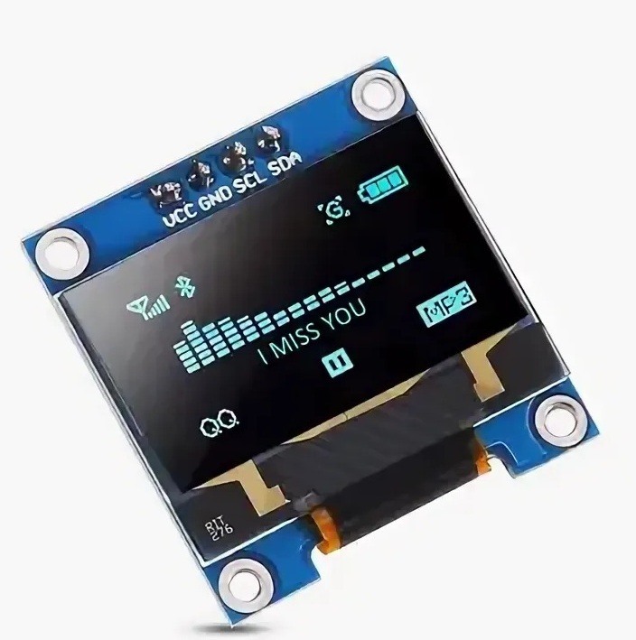

## [Сообщения на Oled-дисплей из задачи через уведомления, расщепление uint32_t на составляющие, вынос во вне кнопок сброса и прошивки ESP32-CAM](https://github.com/Vladimir-Trufanov/BitofExpert/blob/main/bifeEsp32/soobshcheniya-na-oled-rasshcheplenie-uint32t-vynos-sbrosa-i-proshivki/soobshcheniya-na-oled-rasshcheplenie-uint32t-vynos-sbrosa-i-proshivki.md) [2025-02-24]

OLED-дисплей (128x64) - это графический дисплей, каждый пиксель которого является отдельным OLED (organic light-emitting diode) светодиодом. В отличии от TFT (Thin-Film Transistor), LCD (ЖК) и других дисплеев, этот дисплей не нуждается в подсветке, каждый пиксель светится самостоятельно, а не затемняет свет подсветки. Благодаря этому черный цвет - действительно чёрный (выключенный светодиод не светится в темноте), а белый цвет - действительно белый (не проходит через слой жидких кристаллов или тонкоплёночных транзисторов).

Использование органических светодиодов позволило достичь угла обзора более 160° и значительно снизить энергопотребление. Так же стоит отметить высокую контрастность (что повышает удобочитаемость текста и изображений), и небольшие размеры дисплея, всего 0.96 дюйма. Всё это, в сочетании с удобством и функциональностью, позволяет сказать что OLED-дисплей (128x64) один из лучших.

#### Характеристики:

```
Тип дисплея: графический, OLED (organic light-emitting diode) на основе органических светодиодов.
Тип драйвера матрицы: SSD1306.
Разрешение: 128 x 64 точек.
Цвет пикселей (светодиодов): белый.
Количество цветов: белый и черный (монохромный).
Угол обзора: > 160°.
Коэффициент контрастности: 10000:1.
Яркость: >120 кд/м2.
Напряжение питания: 3,3 ... 5 В.
Энергопотребление: до 80 мВт (при свечении всего экрана);
Интерфейс: I2C (поддерживается Arduino, WeMos, STM32, MSP430 и множеством других микроконтроллеров, и отладочных плат).
Адрес на шине I2C: 0x3C или 0x3D выбирается переключателем.
Время отклика < 10 мкс.
Рабочая температура: -40 ... 85 °С.
Габариты: 30x30 мм.
```



### [Сообщения на Оled-дисплей из задачи через уведомления](#%D1%81%D0%BE%D0%BE%D0%B1%D1%89%D0%B5%D0%BD%D0%B8%D1%8F-%D0%BD%D0%B0-oled-%D0%B4%D0%B8%D1%81%D0%BF%D0%BB%D0%B5%D0%B9-%D0%B8%D0%B7-%D0%B7%D0%B0%D0%B4%D0%B0%D1%87%D0%B8-%D1%87%D0%B5%D1%80%D0%B5%D0%B7-%D1%83%D0%B2%D0%B5%D0%B4%D0%BE%D0%BC%D0%BB%D0%B5%D0%BD%D0%B8%D1%8F)


### Сообщения на Oled-дисплей из задачи через уведомления

Существует несколько библиотек для работы с Oled-дисплеями. Основной пример статьи использует две библиотеки ***[Adafruit_SSD1306.h v2.5.13](Adafruit_SSD1306.zip)*** и ***[Adafruit_GFX.h v1.11.11](Adafruit-GFX-Library.zip)***, установленные из IDE Arduino.


Подключение этих двух библиотек позволяет работать с дисплеем, но без использования русских букв. Для руссификации дисплея следует в библиотеке ***Adafruit_GFX.h*** заменить оригинальный файл шрифтов ***glcdfont.c*** на его ***[руссифицированную версию](glcdfont.c.zip)***.

Но есть ещё одна особенность. Кодировка символов Oled-дисплея является однобайтовой, поэтому перед загрузкой русских символов их следует перекодировать из ***Utf8*** в ***Windows-1251***. Об этих процедурах хорошо изложено в статье ***["Русификация библиотеки Adafruit-GFX и вывод русских букв на дисплей в кодировке UTF-8 из Arduino IDE"](https://arduino.ru/forum/programmirovanie/rusifikatsiya-biblioteki-adafruit-gfx-i-vyvod-russkikh-bukv-na-displei-v-kodi)***.

В следующем примере показано подключение Oled-дисплея к плате ESP32-CAM для вывода кратких сообщений журнала приложения. 

#### [Тестовая программа работы с OLED-дисплеем SSD1306 128x64 на ESP32-CAM в отдельной задаче и назначением собственных выводов I2С](Rus32CAMExt5/Rus32CAMExt5.ino)


#### OLED SSD1306.jpg


### Библиография

#### [ESP-WebOTA Легко добавляйте веб-обновления OTA в свои проекты ESP32/ESP8266](https://github.com/scottchiefbaker/ESP-WebOTA)

#### [Разделить uint-32 на байты](https://forum.arduino.cc/t/solved-split-uint-32-to-bytes/532751)

#### [ESP32 – Автоматическое программирование и сброс настроек](https://www.studiopieters.nl/esp32-auto-program-reset/)

#### [Форматирование карты microSD, фотографирование с PIR или без и сохранение снимка на SD-карте](https://www.diyengineers.com/2023/04/13/esp32-cam-complete-guide/)

#### [Как назначить фиксированный IP-адрес вашему устройству ESP32](https://arduinokitproject.com/esp32-static-ip-tutorial/)

#### [Источник пробуждения ESP32-CAM, Таймер](https://lastminuteengineers.com/esp32-deep-sleep-wakeup-sources/)

#### [ThingPulse OLED SSD1306 (ESP8266/ESP32/Mbed-OS)](https://github.com/ThingPulse/esp8266-oled-ssd1306/tree/master)


### OLED дисплей на русском языке

#### [Описание команд - Adafruit_SSD1306 Class Reference](https://adafruit.github.io/Adafruit_SSD1306/html/class_adafruit___s_s_d1306.html)

#### [Дисплей SSD1306 подключаем к Arduino. Выводим текст, рисуем фигуры](https://portal-pk.ru/news/232-displei-ssd1306-podklyuchaem-k-arduino-vyvodim-tekst-risuem.html)

#### [ESP32-CAM With SSD1306 OLED Display](https://github.com/ClaudeMarais/ESP32-CAM_With_SSD1306)

#### [ESP32 и ESP8266 с выводом статуса на веб-страницу и на OLED дисплей](https://arduino-tex.ru/news/23/esp32-i-esp8266-s-vyvodom-statusa-na-veb-stranicu-i-na-oled.html?ysclid=m76l3hhe1l969660993)

#### [SSD1306 OLED-дисплей, вывод текста на русском языке в Arduino IDE](https://portal-pk.ru/news/233-ssd1306-oled-displei-vyvod-teksta-na-russkom-yazyke-v-arduino-ide.html)

#### [Файлы и библиотеки и другое для Arduino](https://iarduino.ru/file/)

#### [Русификация библиотеки Adafruit-GFX и вывод русских букв на дисплей в кодировке UTF-8 из Arduino IDE](https://arduino.ru/forum/programmirovanie/rusifikatsiya-biblioteki-adafruit-gfx-i-vyvod-russkikh-bukv-na-displei-v-kodi)


