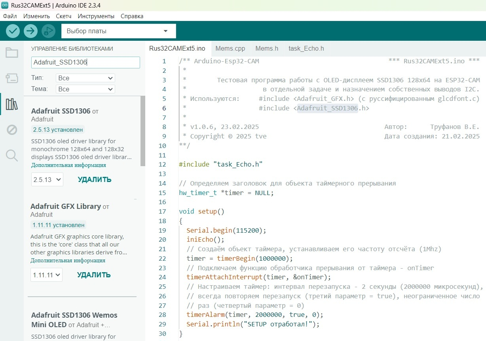
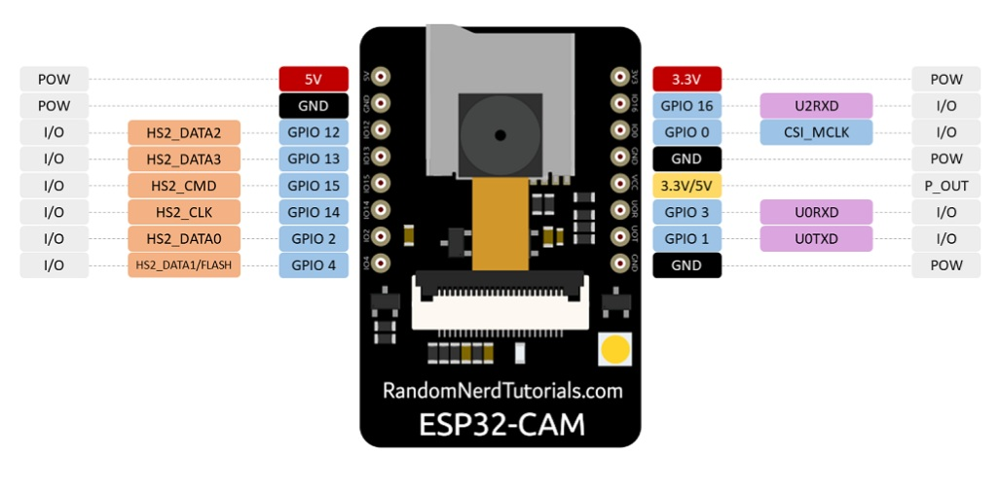
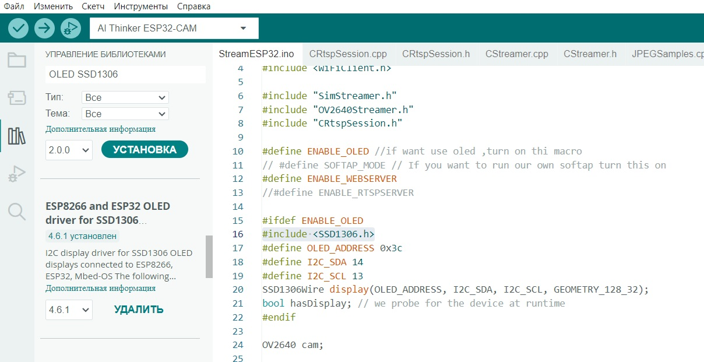

## [Сообщения на Oled-дисплей из задачи через уведомления, расщепление uint32_t на составляющие, вынос во вне кнопок сброса и прошивки ESP32-CAM](https://github.com/Vladimir-Trufanov/BitofExpert/blob/main/bifeEsp32/soobshcheniya-na-oled-rasshcheplenie-uint32t-vynos-sbrosa-i-proshivki/soobshcheniya-na-oled-rasshcheplenie-uint32t-vynos-sbrosa-i-proshivki.md) [2025-02-24]

OLED-дисплей (128x64) - это графический дисплей, каждый пиксель которого является отдельным OLED (organic light-emitting diode) светодиодом. В отличии от TFT (Thin-Film Transistor), LCD (ЖК) и других дисплеев, этот дисплей не нуждается в подсветке, каждый пиксель светится самостоятельно, а не затемняет свет подсветки. Благодаря этому черный цвет - действительно чёрный (выключенный светодиод не светится в темноте), а белый цвет - действительно белый (не проходит через слой жидких кристаллов или тонкоплёночных транзисторов).

Использование органических светодиодов позволило достичь угла обзора более 160° и значительно снизить энергопотребление. Так же стоит отметить высокую контрастность (что повышает удобочитаемость текста и изображений), и небольшие размеры дисплея, всего 0.96 дюйма. Всё это, в сочетании с удобством и функциональностью, позволяет сказать что OLED-дисплей (128x64) один из лучших.

#### Характеристики

```
Тип дисплея: графический, OLED (organic light-emitting diode) на основе органических светодиодов.
Тип драйвера матрицы: SSD1306.
Разрешение: 128 x 64 точек.
Цвет пикселей (светодиодов): белый.
Количество цветов: белый и черный (монохромный).
Угол обзора: > 160°.
Коэффициент контрастности: 10000:1.
Яркость: >120 кд/м2.
Напряжение питания: 3,3 ... 5 В.
Энергопотребление: до 80 мВт (при свечении всего экрана);
Интерфейс: I2C (поддерживается Arduino, WeMos, STM32, MSP430 и множеством других микроконтроллеров, и отладочных плат).
Адрес на шине I2C: 0x3C или 0x3D выбирается переключателем.
Время отклика < 10 мкс.
Рабочая температура: -40 ... 85 °С.
Габариты: 30x30 мм.
```


### [Сообщения на Оled-дисплей из задачи через уведомления](#%D1%81%D0%BE%D0%BE%D0%B1%D1%89%D0%B5%D0%BD%D0%B8%D1%8F-%D0%BD%D0%B0-oled-%D0%B4%D0%B8%D1%81%D0%BF%D0%BB%D0%B5%D0%B9-%D0%B8%D0%B7-%D0%B7%D0%B0%D0%B4%D0%B0%D1%87%D0%B8-%D1%87%D0%B5%D1%80%D0%B5%D0%B7-%D1%83%D0%B2%D0%B5%D0%B4%D0%BE%D0%BC%D0%BB%D0%B5%D0%BD%D0%B8%D1%8F)

### [Расщепление uint32_t на составляющие c помощью union](#%D1%80%D0%B0%D1%81%D1%89%D0%B5%D0%BF%D0%BB%D0%B5%D0%BD%D0%B8%D0%B5-uint32_t-%D0%BD%D0%B0-%D1%81%D0%BE%D1%81%D1%82%D0%B0%D0%B2%D0%BB%D1%8F%D1%8E%D1%89%D0%B8%D0%B5-%D1%81-%D0%BF%D0%BE%D0%BC%D0%BE%D1%89%D1%8C%D1%8E-union)


### Сообщения на Oled-дисплей из задачи через уведомления

Существует несколько библиотек для работы с Oled-дисплеями. Основной пример статьи использует две библиотеки ***[Adafruit_SSD1306.h v2.5.13](Adafruit_SSD1306.zip)*** и ***[Adafruit_GFX.h v1.11.11](Adafruit-GFX-Library.zip)***, установленные из IDE Arduino.



Подключение этих двух библиотек позволяет работать с дисплеем, но без использования русских букв. Для руссификации дисплея следует в библиотеке ***Adafruit_GFX.h*** заменить оригинальный файл шрифтов ***glcdfont.c*** на его ***[руссифицированную версию](glcdfont.c.zip)***.

Но есть ещё одна особенность. Кодировка символов Oled-дисплея является однобайтовой, поэтому перед загрузкой русских символов их следует перекодировать из ***Utf8*** в ***Windows-1251***. Об этих процедурах хорошо изложено в статье ***["Русификация библиотеки Adafruit-GFX и вывод русских букв на дисплей в кодировке UTF-8 из Arduino IDE"](https://arduino.ru/forum/programmirovanie/rusifikatsiya-biblioteki-adafruit-gfx-i-vyvod-russkikh-bukv-na-displei-v-kodi)***.

В следующем примере используется подключение Oled-дисплея к плате ESP32-CAM для вывода кратких сообщений журнала приложения с помощью этих инструментов. 



В примере контакт SDA дисплея подключается к 14 пину контроллера (GPIO14), а контакт SCL к 13 пину (так как карта microSD не используется). При необходимости можно использовать еще 2 пары контактов (GPIO3 и GPIO1, если не используется аппаратный последовательный порт или GPIO0 и GPIO16).


#### Тестовая программа работы с OLED-дисплеем SSD1306 128x64 на ESP32-CAM в отдельной задаче и назначением собственных выводов I2С

В приложении отправляются 32-разрядные уведомления в задачу ***Echo*** (#include "task_Echo.h") из двух мест: из таймерного прерывания ***onTimer()*** и низкоприоритетного основного цикла ***loop()***. 

Уведомление имеет следующую структуру:

```
// Определяем структуру уведомления задачи по работе с дисплеем
// с расщеплением на команды по формированию сообщений приложения
typedef union
{
  uint32_t value;      // для контрольного значения = 0x1A2B3C4D; 
  struct 
  {
  	uint8_t сode;      // код сообщения = 1 байт (от 0 до 255)
    unsigned v00:4;    // младшая контекстная тетрада  (0-15)
    unsigned v01:4;    // старшая контекстная тетрада  (0-15)
    uint16_t calc;     // счётчик или беззнаковое целое (0-65535)
  }
  nibbles;
}
split;
```
Уведомления, поступающие в задачу ***Echo*** из прерывания содержат код команды ***uint8_t сode = 1*** и значение счетчика прерываний ***uint16_t calc***.

Уведомления, поступающие из основного цикла могут содержать:

-  ***uint32_t value = 0x1A2B3C4D*** - контрольное значение, занимающее всё пространство уведомления;
-  команды ***uint8_t сode = 13*** или ***uint8_t сode = 14***, заставляющие менять направление движения строк в дисплее;
-  прочие команды, заставляющие выводить на дисплей сообщение из списка в функции ***String TakeMess(uint8_t code)***.


```
/** Arduino-Esp32-CAM                                  *** Rus32CAMExt5.ino ***
 *                          
 *        Тестовая программа работы с OLED-дисплеем SSD1306 128x64 на ESP32-CAM
 *                    в отдельной задаче и назначением собственных выводов I2С.
 * Используются:     #include <Adafruit_GFX.h> (с руссифицированным glcdfont.c)
 *                   #include <Adafruit_SSD1306.h>
 * 
 * v1.0.7, 24.02.2025                                 Автор:      Труфанов В.Е.
 * Copyright © 2025 tve                               Дата создания: 21.02.2025
**/

#include "task_Echo.h"

// Определяем заголовок для объекта таймерного прерывания
hw_timer_t *timer = NULL;

void setup() 
{
  Serial.begin(115200);
  iniEcho();
  // Создаём объект таймера, устанавливаем его частоту отсчёта (1Mhz)
  timer = timerBegin(1000000);
  // Подключаем функцию обработчика прерывания от таймера - onTimer
  timerAttachInterrupt(timer, &onTimer);
  // Настраиваем таймер: интервал перезапуска - 2 секунды (2000000 микросекунд),
  // всегда повторяем перезапуск (третий параметр = true), неограниченное число 
  // раз (четвертый параметр = 0) 
  timerAlarm(timer, 2000000, true, 0);
  Serial.println("SETUP отработал!");
}

// ****************************************************************************
// *           Отправить уведомление cо значением задаче из прерывания        *
// ****************************************************************************

int i=0; // счётчик прерываний
static split CommAndCalc;

void ARDUINO_ISR_ATTR onTimer() 
{
  // Резервируем переменную для значения
  uint32_t ulStatusRegister;
  // Резервируем регистратор приоритета разблокированной задачи
  BaseType_t xHigherPriorityTaskWoken;
  i++;
  CommAndCalc.nibbles.сode=1;
  CommAndCalc.nibbles.calc=i;

  Serial.print("Прерывание сработало "); Serial.print(i); Serial.println(" раз");
  // Готовим значение для передачи с оповещением
  ulStatusRegister = CommAndCalc.value;
  // Инициализируем xHigherPriorityTaskWoken значением false. При вызове
  // функция xTaskNotifyFromISR() разблокирует задачу обработки, и если приоритет
  // задачи обработки выше приоритета текущей запущенной задачи, то для функции 
  // xHigherPriorityTaskWoken автоматически будет установлено значение pdTRUE
  xHigherPriorityTaskWoken = pdFALSE;
  // Передаём сообщение в задачу обработки от прерывания. xHandlingTask - это дескриптор задачи,
  // который был получен когда задача была создана. eSetValueWithOverwrite - заставляем уведомление 
  // для целевой задачи обязательно быть равным отправляемому значению ulStatusRegister.
  xTaskNotifyFromISR(xHandlingEcho,ulStatusRegister,eSetValueWithOverwrite,&xHigherPriorityTaskWoken);
  // Принудительно переключаеме контекст на задачу xHandlingTask, так как теперь xHigherPriorityTaskWoken = pdTRUE
  portYIELD_FROM_ISR( xHigherPriorityTaskWoken );
}

void loop() 
{
  // Резервируем переменную для значения
  uint32_t ulValue;
  // Даём возможность поработать счетчику прерываний без помех 
  delay(10000);
  
  // Направляем сообщения вверх, code=13
  xTaskNotify(xHandlingEcho,13,eSetValueWithOverwrite);   // "Вверх - команда на движение строк СНИЗУ-ВВЕРХ"
  delay(2000);
  // Передаём контрольное сообщение в задачу. xHandlingEcho - это дескриптор задачи,
  // который был получен когда задача была создана. eSetValueWithOverwrite - заставляем уведомление 
  // для целевой задачи обязательно быть равным отправляемому значению ulStatusRegister.
  ulValue=0x1A2B3C4D;
  xTaskNotify(xHandlingEcho,ulValue,eSetValueWithOverwrite);
  delay(2000);
  // Передаем учтенные сообщения
  xTaskNotify(xHandlingEcho,0,eSetValueWithOverwrite);    // "NULL"
  delay(2000);
  xTaskNotify(xHandlingEcho,2,eSetValueWithOverwrite);    // "Привет!"
  delay(2000);
  xTaskNotify(xHandlingEcho,3,eSetValueWithOverwrite);    // "555"
  delay(2000);
  xTaskNotify(xHandlingEcho,4,eSetValueWithOverwrite);    // "Привет МИР, такой очень удивительный"
  delay(2000);
  xTaskNotify(xHandlingEcho,5,eSetValueWithOverwrite);    // "01234567890123456789"
  delay(2000);
  // Передаем неучтенное сообщение
  xTaskNotify(xHandlingEcho,254,eSetValueWithOverwrite);  // "Неизвестно"
  delay(2000);
  
  // Возвращаем направление движения вниз, code=14
  xTaskNotify(xHandlingEcho,14,eSetValueWithOverwrite);   // "Вниз  - команда на движение строк СВЕРХУ-ВНИЗ"
  delay(2000);
  xTaskNotify(xHandlingEcho,6,eSetValueWithOverwrite);    // "Hello"
  delay(2000);
  xTaskNotify(xHandlingEcho,7,eSetValueWithOverwrite);    // "world"
  delay(2000);
  xTaskNotify(xHandlingEcho,8,eSetValueWithOverwrite);    // "идем"
  delay(2000);
  xTaskNotify(xHandlingEcho,9,eSetValueWithOverwrite);    // "уже"
  delay(2000);
  xTaskNotify(xHandlingEcho,10,eSetValueWithOverwrite);  // "внизёхонько"
  delay(2000);
  xTaskNotify(xHandlingEcho,11,eSetValueWithOverwrite);  // "Сейчас"
  delay(2000);
  xTaskNotify(xHandlingEcho,12,eSetValueWithOverwrite);  // "0123456789"
}

// ******************************************************* Rus32CAMExt5.ino ***
```

```
/** Arduino-Esp32-CAM                                       *** task_Echo.h ***
 *                          
 *               Задача вывода сообщений журнала на OLED-дисплее SSD1306 128x64 
 *                                     на ESP32-CAM с назначенными выводами I2С
 *
 * Используются:     #include <Adafruit_GFX.h> (с руссифицированным glcdfont.c)
 *                   #include <Adafruit_SSD1306.h>
 * 
 * v1.0.7, 24.02.2025                                 Автор:      Труфанов В.Е.
 * Copyright © 2025 tve                               Дата создания: 21.02.2025
**/

#pragma once

#include <Wire.h>
#include <Adafruit_GFX.h>
#include <Adafruit_SSD1306.h>

// Назначаем объекты для работы через шину I2C с OLED-дисплеем
static TwoWire I2Cbus = TwoWire(0);  // объект для работы с шиной I2C
static Adafruit_SSD1306 display;     // объект дисплея
// Назначаем пины для подключения дисплея по шине I2C к контроллеру
#define I2C_SDA 14                   // контакт SDA к GPIO14 
#define I2C_SCL 13                   // контакт SCL к GPIO13
// Определяем параметры экрана и направления движения строк
#define SCREEN_WIDTH 128             // ширина экрана OLED-дисплея в пикселах
#define SCREEN_HEIGHT 64             // высота экрана OLED-дисплея в пикселах
#define TopToBottom    1             // сверху-вниз   
#define FromBottomTop  2             // снизу-вверх   
// Определяем структуру уведомления задачи по работе с дисплеем
// с расщеплением на команды по формированию сообщений приложения
typedef union
{
  uint32_t value;      // для контрольного значения = 0x1A2B3C4D; 
  struct 
  {
  	uint8_t сode;      // код сообщения = 1 байт (от 0 до 255)
    unsigned v00:4;    // младшая контекстная тетрада  (0-15)
    unsigned v01:4;    // старшая контекстная тетрада  (0-15)
    uint16_t calc;     // счётчик или беззнаковое целое (0-65535)
  }
  nibbles;
}
split;
// ****************************************************************************
// *       Сформировать сообщение приложения для  OLED-дисплея SSD1306        *
// *                      по коду из поступившего уведомления                 *
// ****************************************************************************
#define def(ncase,mmess)  case (ncase): mess=(mmess); break;  // макрос функции
/* Описания кодов:
   1          - поступило значение счетчика прерываний
   13         - поступила команда начать движение строк СНИЗУ-ВВЕРХ
   14         - поступила команда начать движение строк СВЕРХУ-ВНИЗ
   0x1A2B3C4D - контрольное сообщение "0x1A2B3C4D"
   Остальные коды вызывают вывод на дисплей соответствующих сообщений
*/
String TakeMess(uint8_t code)
{
  String mess;
  switch (code) {
  def (0x1A2B3C4D,"0x1A2B3C4D")
  def ( 0, "NULL")
  def ( 1, ": ISR")
  def ( 2, "Привет!")
  def ( 3, "555")
  def ( 4, "Привет МИР, такой очень удивительный")
  def ( 5, "01234567890123456789")

  def ( 6, "Hello")
  def ( 7, "world")
  def ( 8, "идем")
  def ( 9, "уже")
  def (10, "внизёхонько")
  def (11, "Сейчас")
  def (12, "0123456789")

  def (13, "Идем ВВЕРХ")
  def (14, "Поток ВНИЗ")

  default: mess="Неизвестно"; break;
  }
  return mess;
}
// ****************************************************************************
// *                      Отрезать лишние символы справа                      *
// *   (по умолчанию задача настраивает вывод на дислей символы среднего      *
// *         размера - четыре строки по не более чем 10 символов)             *
// ****************************************************************************
String squezy(String str)
{
  String strUtf8;
  return strUtf8=str.substring(0,10);
}
// ****************************************************************************
// *            Перекодировать русские буквы из UTF-8 в Win-1251              *
// ****************************************************************************
String utf8rus(String source)
{
  int i,k;
  String target;
  unsigned char n;
  char m[2] = { '0', '\0' };
  k = source.length(); i = 0;
  while (i < k) 
  {
    n = source[i]; i++;
    if (n >= 0xC0) 
    {
      switch (n) 
      {
        case 0xD0: 
        {
          n = source[i]; i++;
          if (n == 0x81) { n = 0xA8; break; }
          if (n >= 0x90 && n <= 0xBF) n = n + 0x30;
          break;
        }
        case 0xD1: 
        {
          n = source[i]; i++;
          if (n == 0x91) { n = 0xB8; break; }
          if (n >= 0x80 && n <= 0x8F) n = n + 0x70;
          break;
        }
      }
    }
    m[0] = n; target = target + String(m);
  }
return target;
}
// ****************************************************************************
// *      Отработать задачу по выводу сообщений на OLED-дисплей SSD1306       *
// ****************************************************************************
void Echo (void* pvParameters) 
{
  int i;                             // счетчик внутренних циклов
  uint32_t ulInterruptStatus;        // уведомление к задаче
  static split EchoComm;             // расщепление уведомления
  static int direction=TopToBottom;  // текущее направление движения строк
  // Инициируем программную шину I2C
  I2Cbus.begin(I2C_SDA,I2C_SCL,100000);
  // Подключаем дисплей к шине 
  Adafruit_SSD1306 display(SCREEN_WIDTH, SCREEN_HEIGHT, &I2Cbus, -1);
  if(!display.begin(SSD1306_SWITCHCAPVCC, 0x3C)) 
  { 
    Serial.println("SSD1306 - ошибка подключения к I2C");
    //for(;;);
  }
  vTaskDelay(97/portTICK_PERIOD_MS);
  // Включаем использование новых версий Adafruit-GFX (в том числе руссификация)
  display.cp437(true);
  // Выбираем средний размер шрифта и цвет
  display.setTextSize(2);             
  display.setTextColor(WHITE);  
  // Выполняем начальное заполнение массива сообщений
  String aLines[4]; 
  aLines[0]=" "; aLines[1]=" "; aLines[2]=" "; aLines[3]=" ";
  // Делаем первый вывод на экран
  display.clearDisplay();
  for (i=0; i<4; i++)
  {
    display.setCursor(0,i*16);             
    display.println(aLines[i]);
  }
  display.display();
  vTaskDelay(97/portTICK_PERIOD_MS);
  // Циклически отрабатываемпоступающие уведомления
  while (1) 
  {
    // Ждём получения уведомления, которое будет отправлено непосредственно в эту задачу.   
    xTaskNotifyWait ( 
      0,              
      0,       
      &ulInterruptStatus, // для приёма значения 
      portMAX_DELAY       // блокировка до приема на неопределённый срок
    );
    // Выполняем обработку уведомления                       
    EchoComm=split(ulInterruptStatus);
    // Выделяем команду
    uint8_t inсode=EchoComm.nibbles.сode;
    // Формируем сообщение текущей строки
    String inmess="Undefaund!";
    if (EchoComm.value==0x1A2B3C4D) inmess="Контроль";
    else if (inсode==1) inmess=String(EchoComm.nibbles.calc)+TakeMess(inсode);
    // При необходимости устанавливаем направление движения строк вверх 
    // def (13, "Вверх - команда на движение строк СНИЗУ-ВВЕРХ")
    else if (inсode==13) 
    {
      direction=FromBottomTop;
      inmess=TakeMess(inсode);
    }
    // Или устанавливаем направление движения строк вниз 
    // def (14, "Вниз  - команда на движение строк СВЕРХУ-ВНИЗ")
    else if (inсode==14) 
    {
      direction=TopToBottom;
      inmess=TakeMess(inсode);
    }
    else inmess=TakeMess(inсode);
    // Сдвигаем 3 строки на 1 позицию, заполняем первую
    for (i=3; i>0; i--)
    {
      aLines[i]=aLines[i-1];
    }
    aLines[0]=squezy(utf8rus(inmess));
    // Очищаем в мгновение дисплей 
    display.clearDisplay();
    // Выводим строки на дисплей сверху-вниз
    if (direction==TopToBottom)
    {
      for (i=0; i<4; i++)
      {
        display.setCursor(0,i*16);             
        display.println(aLines[i]);
      }
    }
    // Или снизу-вверх
    else
    {
      for (i=0; i<4; i++)
      {
        display.setCursor(0,i*16);             
        display.println(aLines[3-i]);
      }
    }
    // Зажигаем дисплей
    display.display();
    vTaskDelay(97/portTICK_PERIOD_MS);
  }
}
// ****************************************************************************
// *          Определить задачу по выводу сообщений на Oled-дисплей           *
// *                 по блокирующим уведомлениям к задаче                     *
// ****************************************************************************
// Определяем заголовок задачи Echo, играющей роль блокированных действий. 
// Другая задача RTOS (или обработчик прерывания) вызовет функцию оповещения, 
// а затем будет ожидать его в заблокированном состоянии (чтобы не использовать 
// процессорное время) до тех пор, пока не будет получено уведомление о 
// завершении передачи. Передача осуществляется с помощью DMA и в завершении 
// прерывания также DMA используется для отправки уведомления задаче
static TaskHandle_t xHandlingEcho = NULL;  
// Определяем задачу Echo
void iniEcho() 
{
  xTaskCreatePinnedToCore (
    Echo,            // название функции, которая будет запускаться, как параллельная задача
    "Echo",          // название задачи
    3072,            // размер стека в байтах
    NULL,            // указатель на параметр новой задаче. NULL, если параметр не передаётся.
    1,               // приоритет задачи
    &xHandlingEcho,  // дескриптор (указатель или заголовок) на задачу
    1                // идентификатор ядра процессора, на котором требуется запустить задачу. 
  );
}

// ************************************************************ task_Echo.h ***
```
###### [в начало](#%D1%85%D0%B0%D1%80%D0%B0%D0%BA%D1%82%D0%B5%D1%80%D0%B8%D1%81%D1%82%D0%B8%D0%BA%D0%B8)


### [Расщепление uint32_t на составляющие с помощью union](https://forum.arduino.cc/t/solved-split-uint-32-to-bytes/532751)

Так как разработчиками FreeRTOS была реализована идея замены семафоров и мьютексов 32-разрядными уведомлениями к задачам возникла потребность интерпретировать всяко-разно само уведомление.

И здесь хорошо употребить конструкцию ***union***, которая позволяет манипулировать данными Arduino и объединение их с помощью структур.

Union позволяет объединить и записать несколько переменных в однобайтовый массив для отправки по Bluetooth, i2c, EspNow или любому другому протоколу, работающему с массивами;

позволяет записать данные в одном формате, а затем прочитать в другом.

#### [Пример расщепления uint32_t на составляющие с помощью union](Rus32CAMExt6/Rus32CAMExt6.ino)


<!--

#### OLED SSD1306.jpg



### Библиография

#### [ESP-WebOTA Легко добавляйте веб-обновления OTA в свои проекты ESP32/ESP8266](https://github.com/scottchiefbaker/ESP-WebOTA)

#### [Разделить uint-32 на байты](https://forum.arduino.cc/t/solved-split-uint-32-to-bytes/532751)

#### [ESP32 – Автоматическое программирование и сброс настроек](https://www.studiopieters.nl/esp32-auto-program-reset/)

#### [Форматирование карты microSD, фотографирование с PIR или без и сохранение снимка на SD-карте](https://www.diyengineers.com/2023/04/13/esp32-cam-complete-guide/)

#### [Как назначить фиксированный IP-адрес вашему устройству ESP32](https://arduinokitproject.com/esp32-static-ip-tutorial/)

#### [Источник пробуждения ESP32-CAM, Таймер](https://lastminuteengineers.com/esp32-deep-sleep-wakeup-sources/)

#### [ThingPulse OLED SSD1306 (ESP8266/ESP32/Mbed-OS)](https://github.com/ThingPulse/esp8266-oled-ssd1306/tree/master)


### OLED дисплей на русском языке

#### [Описание команд - Adafruit_SSD1306 Class Reference](https://adafruit.github.io/Adafruit_SSD1306/html/class_adafruit___s_s_d1306.html)

#### [Дисплей SSD1306 подключаем к Arduino. Выводим текст, рисуем фигуры](https://portal-pk.ru/news/232-displei-ssd1306-podklyuchaem-k-arduino-vyvodim-tekst-risuem.html)

#### [ESP32-CAM With SSD1306 OLED Display](https://github.com/ClaudeMarais/ESP32-CAM_With_SSD1306)

#### [ESP32 и ESP8266 с выводом статуса на веб-страницу и на OLED дисплей](https://arduino-tex.ru/news/23/esp32-i-esp8266-s-vyvodom-statusa-na-veb-stranicu-i-na-oled.html?ysclid=m76l3hhe1l969660993)

#### [SSD1306 OLED-дисплей, вывод текста на русском языке в Arduino IDE](https://portal-pk.ru/news/233-ssd1306-oled-displei-vyvod-teksta-na-russkom-yazyke-v-arduino-ide.html)

#### [Файлы и библиотеки и другое для Arduino](https://iarduino.ru/file/)

#### [Русификация библиотеки Adafruit-GFX и вывод русских букв на дисплей в кодировке UTF-8 из Arduino IDE](https://arduino.ru/forum/programmirovanie/rusifikatsiya-biblioteki-adafruit-gfx-i-vyvod-russkikh-bukv-na-displei-v-kodi)

-->

###### [в начало](#%D1%85%D0%B0%D1%80%D0%B0%D0%BA%D1%82%D0%B5%D1%80%D0%B8%D1%81%D1%82%D0%B8%D0%BA%D0%B8)


