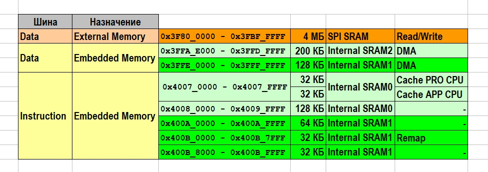
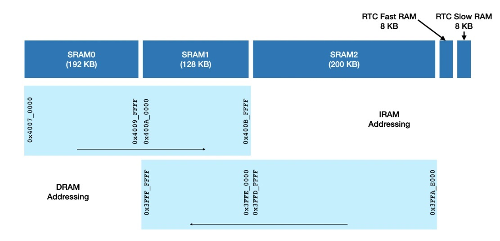
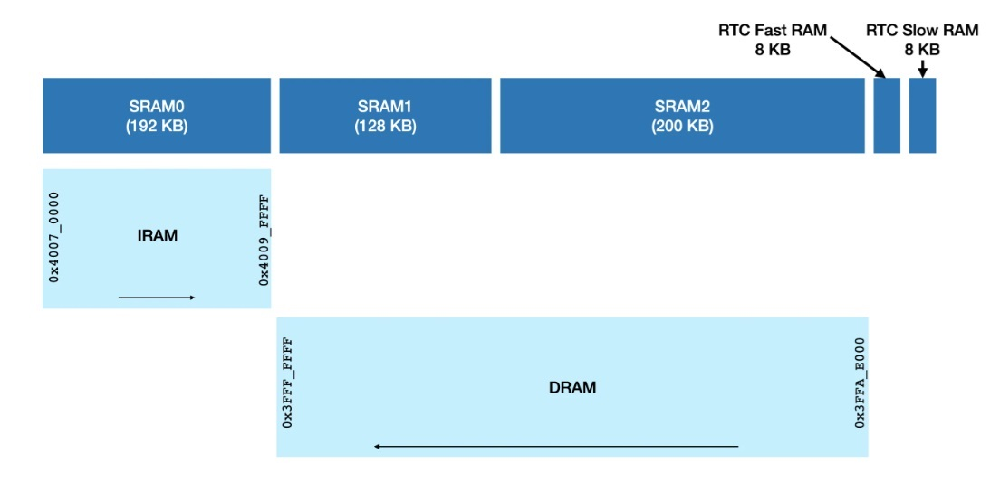
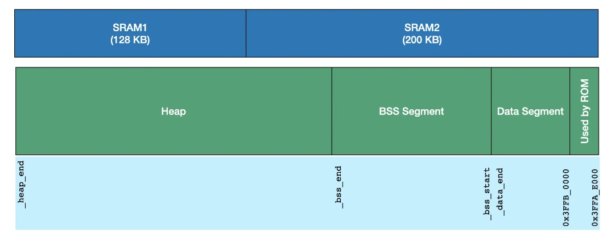
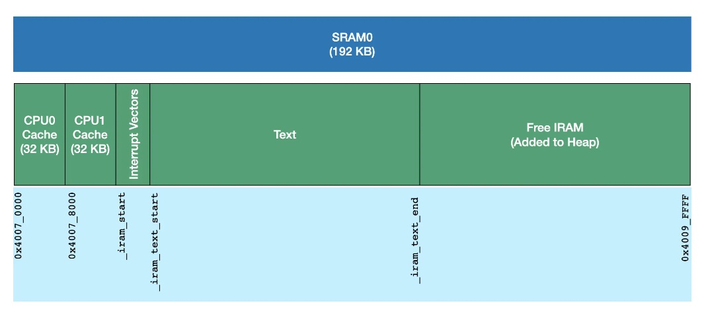

## [Все про встроенную оперативную память Esp32](#)

FreeRTOS (операционная система ESP32) использует общие конструкции компьютерной архитектуры:

***статическая память*** – память, выделяемая под переменные во время компиляции;

***heap или куча*** – динамическая память, выделяемая под задачи приложения и нужды FreeRTOS, вызовами специальных функций malloc и calloc и другими,

***стек*** – динамическая память внутри кучи, автоматически заполняющаяся и освобождающаяся каждой задачей (потоком) приложения в процессе выполнения.

При этом сам микроконтроллер ESP32 включает несколько типов оперативной памяти ( RAM ):

***DRAM (ОЗУ данных)*** — это память, которая подключена к шине данных ЦП и используется для хранения данных. Это наиболее распространенный вид памяти, доступ к которому осуществляется в виде кучи и стека. При запуске куча DRAM содержит всю память данных, которая не выделена приложением статически. Уменьшение статически выделяемых буферов увеличивает объем доступной свободной кучи и наоборот.

***IRAM (ОЗУ инструкций)*** — это память, которая подключена к шине инструкций ЦП и обычно содержит только исполняемые данные (т.е. инструкции, или скомпилированную программу). Важно понимать: в этой части оперативной памяти находится не вся ваша программа, а только отдельные функции, помещенные атрибутом IRAM_ATTR, а весь остальной код находится во flash-памяти и вызывается прямо оттуда. Однако её в некоторых случаях можно использовать и в качестве обычной памяти. Если доступ к IRAM осуществляется как доступ к общей памяти, все обращения должны быть в  32-битных единицах. 

D/IRAM — это ОЗУ, которое подключено к шине данных ЦП и шине инструкций, поэтому может использоваться как ОЗУ инструкций, так и ОЗУ данных. 

Также к ESP32 можно подключить внешнюю ***SPI RAM***. Внешняя оперативная память интегрирована в карту памяти ESP32 через кеш в DRAM, и доступ к ней осуществляется аналогично DRAM. 



---

### Организация DRAM

### Организация IRAM

### Выделение памяти кучи

### Библиография

---

### Организация DRAM

В Esp32 размещено 520 КБ встроенной оперативной памяти для данных и инструкций (SRAM), которая разделена на три части: Internal SRAM0 (192 КБ), Internal SRAM1 (128 КБ) и Internal SRAM2 (200 Кбайт).

Часть SRAM предоставляется шине памяти команд (IRAM) и шине памяти данных (DRAM). Память команд является исполняемой и может быть прочитана или записана только в виде 4-байтовых выровненных слов. Память данных не является исполняемой и может быть доступна только для чтения или записи в виде отдельных байтов. 



Как правило, приложениям не хватает памяти для хранения данных и SRAM1 отдается шине данных. В обычном делении оперативной памяти 192 КБ получает IRAM,  328 КБ DRAM. 

Хотя для приложения это не имеет большого значения, так как они не пересекаются, следует обратить внимание, что направление адресного диапазона для IRAM и DRAM противоположное.



Адреса DRAM начинаются с конца SRAM2 и увеличиваются в обратном направлении.

Первые 8 КБ (0x3FFA_E000-0x3FFA_FFFF) используются в качестве памяти для хранения данных некоторых функций ПЗУ. Затем компоновщик размещает инициализированный сегмент данных (Data Segment). Следующим идет сегмент BSS - «block started by symbol», где хранятся неинициализированные глобальные и статические переменные.

Память, оставшаяся после выделения сегментов данных и BSS, настраивается для использования в качестве кучи. Именно сюда обычно помещается динамическая память.

Так как размер сегментов данных и BSS зависит от приложения, то каждое приложение изначально имеет разный доступный размер кучи.

В куче есть две области (0x3FFE_0000 - 0x3FFE_0440) 1088 байт и (0x3FFE_3F20 - 0x3FFE_4350) 1072 байта, которые используются в качестве ПЗУ для хранения данных. Эти области помечены как зарезервированные, и распределитель кучи не выделяет память из этих областей.

> Данные, помеченные как ***static const*** (cтатические константы, то есть данные, значение которых можно только прочитать и нельзя изменить) сохраняют своё значение на всём протяжении работы программыю. Область их видимости остаётся локальной: взаимодействовать с переменной можно только внутри блока кода, где она создана (и во всех вложенных в него). 

> По умолчанию статические константы размещаются во внешней флэш-памяти. Если необходимо их разместить в DRAM, то используется атрибут ***[DRAM_ATTR]()***.



Когда функция Bluetooth включена, контроллеру Bluetooth необходимо использовать выделенную память для данных. Эта память используется в качестве памяти для данных и BSS контроллера, а также для передачи пакетов Bluetooth между программным и аппаратным обеспечением. Поэтому компоновщик резервирует 54 КБ памяти по умолчанию в диапазоне 0x3FFB_0000 - 0x3FFB_DB5C. Распределение сегментов данных и BSS приложения продолжается за пределами этого диапазона.

Когда приложение использует только функции BLE, часть памяти контроллера Bluetooth может быть возвращена в кучу. Объём памяти, который освобождается и добавляется в кучу, составляет ~19 КБ.

> Bluetooth и BLE - это технологии беспроводной связи, использующие протокол Bluetooth, но для разных целей и имеют разные характеристики. Bluetooth требует высокой скорости передачи данных и доступа к питанию, в то время как BLE используется для маломощных приложений с низкой скоростью передачи данных от небольших батарей, таких как устройства IoT.

Когда включена трассировка, то отбирается от кучи и фиксируется память Trace Memory объёмом 32 КБ в конце DRAM: 0x3FF8_0000 - 0x3FFF_FFFF. 

### Организация IRAM

192 КБ доступной оперативной памяти в ESP32 используется для выполнения кода, а также частично в качестве кэш-памяти для доступа к флэш-памяти (и PSRAM).

- Первые 32 КБ оперативной памяти используются в качестве кэша ЦП0, а следующие 32 КБ - в качестве кэша ЦП1. Это статически задано аппаратно и не может быть изменено.

- После первых 64 КБ скрипт компоновщика начинает размещать текстовую область в IRAM. 

Сначала он размещает все векторы прерываний, а затем весь текст в скомпилированном приложении, который помечен для размещения в IRAM.

> По умолчанию код программы в ESP32 размещается во внешней флэш-памяти. Однако в определённых режимах (например, в обработчиках прерываний) external flash недоступен, поэтому код, который работает в таких режимах, должен быть размещён в IRAM. Иногда, по условиям работы приложения некоторые его части должны быть размещены в IRAM. Во всех этих случаях используется атрибут ***[IRAM_ATTR](#)***. Код функций, помеченный этим атрибутом, будет размещён в IRAM. 

- IRAM после текстового раздела остаётся неиспользуемым и добавляется в кучу.



Кроме того, когда приложение работает в одноядерном режиме, CPU1 не функционирует, а его кэш не используется. В этом случае память кэша 0x4007_8000 - 0x4007_FFFF добавляется в кучу.

Неиспользуемая память IRAM, размещённая в куче, может быть доступна для динамического выделения.

### Выделение памяти кучи

При запуске куча DRAM содержит всю память для данных, которая не выделяется приложением статически. Уменьшение количества статически выделяемых буферов увеличивает объём доступной свободной кучи.

У каждой задачи FreeRTOS есть свой собственный стек. По умолчанию каждый из этих стеков выделяется из кучи при создании задачи. 

При запуске куча IRAM содержит всю память инструкций, которая не используется исполняемым кодом приложения.

Для выделения памяти в куче без каких-либо особых соображений в большинстве целей функции malloc() достаточно. Однако для полного использования всех типов памяти и их характеристик есть распределитель памяти в куче на основе возможностей. Если вы хотите получить память с определёнными свойствами (например, память с поддержкой DMA или исполняемую память), вы можете создать маску для требуемых возможностей и передать её в heap_caps_malloc().

Например, при включении внешней оперативной памяти SPI SRAM, память для определенных целей может быть выделена в ней с помощью heap_caps_malloc(MALLOC_CAP_SPIRAM).

```
// Определения выбора возможностей:

#define MALLOC_CAP_EXEC             (1<<0)  ///< Memory must be able to run executable code
#define MALLOC_CAP_32BIT            (1<<1)  ///< Memory must allow for aligned 32-bit data accesses
#define MALLOC_CAP_8BIT             (1<<2)  ///< Memory must allow for 8/16/...-bit data accesses
#define MALLOC_CAP_DMA              (1<<3)  ///< Memory must be able to accessed by DMA
#define MALLOC_CAP_PID2             (1<<4)  ///< Memory must be mapped to PID2 memory space (PIDs are not currently used)
#define MALLOC_CAP_PID3             (1<<5)  ///< Memory must be mapped to PID3 memory space (PIDs are not currently used)
#define MALLOC_CAP_PID4             (1<<6)  ///< Memory must be mapped to PID4 memory space (PIDs are not currently used)
#define MALLOC_CAP_PID5             (1<<7)  ///< Memory must be mapped to PID5 memory space (PIDs are not currently used)
#define MALLOC_CAP_PID6             (1<<8)  ///< Memory must be mapped to PID6 memory space (PIDs are not currently used)
#define MALLOC_CAP_PID7             (1<<9)  ///< Memory must be mapped to PID7 memory space (PIDs are not currently used)
#define MALLOC_CAP_SPIRAM           (1<<10) ///< Memory must be in SPI RAM
#define MALLOC_CAP_INTERNAL         (1<<11) ///< Memory must be internal; specifically it should not disappear when flash/spiram cache is switched off
#define MALLOC_CAP_DEFAULT          (1<<12) ///< Memory can be returned in a non-capability-specific memory allocation (e.g. malloc(), calloc()) call
#define MALLOC_CAP_IRAM_8BIT        (1<<13) ///< Memory must be in IRAM and allow unaligned access
#define MALLOC_CAP_RETENTION        (1<<14) ///< Memory must be able to accessed by retention DMA
#define MALLOC_CAP_RTCRAM           (1<<15) ///< Memory must be in RTC fast memory

#define MALLOC_CAP_INVALID          (1<<31) ///< Memory can't be used / list end marker
```

Для работ с функциями кучи требуется подключение заголовочного файла:
```
#include "esp_heap_caps.h"
```

> Вся память DRAM доступна побайтно, поэтому все кучи DRAM обладают возможностью MALLOC_CAP_8BIT . Пользователи могут вызвать heap_caps_get_free_size(MALLOC_CAP_8BIT) , чтобы узнать размер всех свободных куч DRAM.

Пример: [heap_caps_get_free_size(MALLOC_CAP_8BIT) reports the wrong number under some circumstances](https://github.com/espressif/esp-idf/issues/6136)

```
// Получить общий размер всех областей памяти, обладающих заданными
// возможностями. Эта функция берёт все регионы, в которых могут быть
// выделены заданные возможности, и суммирует занимаемую ими площадь
//
// Параметр: caps - побитовое ИЛИ флагов MALLOC_CAP_*, указывающих на тип памяти
// Возврат: общий размер в байтах
size_t heap_caps_get_total_size(uint32_t caps);

// Получить общий свободный объём всех регионов с заданными возможностями.
// Эта функция берёт все регионы, в которых могут быть выделены заданные
// возможности, и суммирует имеющееся в них свободное пространство.
//
// Примечание. Обратите внимание, что из-за фрагментации кучи, вероятно, 
// невозможно выделить один блок памяти такого размера. Для этого
// используйте heap_caps_get_largest_free_block().
//
// Параметр: caps - побитовое ИЛИ флагов MALLOC_CAP_*, указывающих на тип памяти
// Возврат: количество свободных байтов в регионах
size_t heap_caps_get_free_size(uint32_t caps);

// Получить общую минимальную свободную память для всех регионов 
// с заданными возможностями. Эта функция добавляет метки всех регионов,
// способных предоставить память с заданными характеристиками.
//
// Примечание. Обратите внимание, что результат может быть меньше
//   глобального минимального объёма доступной кучи такого типа за всё
//   время, так как «нижние границы» отслеживаются для каждой области
//   отдельно. Кучи отдельных регионов могли достичь «нижних границ» в
//   разные моменты времени. Однако этот результат всё равно даёт
//   представление о «наихудшем случае» для минимального объёма
//   свободной кучи за всё время.
//
// Параметр: caps - побитовое ИЛИ флагов MALLOC_CAP_*, указывающих на тип памяти
// Возврат: количество свободных байтов в регионах
size_t heap_caps_get_minimum_free_size(uint32_t caps);
```


```
// https://techtutorialsx.com/2017/12/17/esp32-arduino-getting-the-free-heap/

// Код для этого будет очень простым, так как мы уже определили в EspClass = Esp.h 
// метод для получения значения свободной кучи. Обратите внимание, что методы этого класса доступны 
// через внешнюю переменную под названием ESP.

// Чтобы получить свободную кучу, мы просто вызываем метод getFreeHeap
// внешней переменной ESP. Этот метод не принимает аргументов 
// и возвращает свободную кучу в байтах.

// Важно отметить, что из-за фрагментации памяти может быть невозможно
// выделить весь объём памяти, возвращаемый этой функцией.


void setup() 
{
  Serial.begin(115200);
  Serial.println(ESP.getFreeHeap());
}
 
void loop() {}
```


```
log_i("Total heap: %u", ESP.getHeapSize());
log_i("Free heap: %u", ESP.getFreeHeap());
log_i("Total PSRAM: %u", ESP.getPsramSize());
log_i("Free PSRAM: %d", ESP.getFreePsram());
log_i("spiram size %u", esp_spiram_get_size());
log_i("himem free %u", esp_himem_get_free_size());
log_i("himem phys %u", esp_himem_get_phys_size());
log_i("himem reserved %u", esp_himem_reserved_area_size());
  
```

```
// https://microsin.ru/programming/arm/esp32-c3-heap-memory-allocation.html

DRAM позволяет выделять память с побайтным доступом MALLOC_CAP_8BIT (память можно читать и записывать по байтовому адресу). При вызове функции malloc() её реализация в ESP-IDF вызывает внутри себя heap_caps_malloc(size, MALLOC_CAP_8BIT), чтобы выделить DRAM с возможностью побайтной адресации. Чтобы узнать свободную область кучи DRAM во время выполнения кода, вызовите heap_caps_get_free_size(MALLOC_CAP_8BIT).
```


### Библиография

#### [---ESP32 Programmers’ Memory Model](https://developer.espressif.com/blog/esp32-programmers-memory-model/)

#### [Типы памяти ESP-IDF ESPRESSIF 5.3.1](https://docs.espressif.com/projects/esp-idf/en/v5.3.1/esp32/api-guides/memory-types.html#memory-layout)

#### [Распределение памяти в ESP32](https://kotyara12.ru/iot/esp32_memory/)


#### [---Выделение памяти кучи](https://docs.espressif.com/projects/esp-idf/en/v5.3.1/esp32/api-reference/system/mem_alloc.html)

#### [---Отладка памяти кучи](https://docs.espressif.com/projects/esp-idf/en/v5.3.1/esp32/api-reference/system/heap_debug.html)

#### [---Минимизация использования оперативной памяти](https://docs.espressif.com/projects/esp-idf/en/v5.3.1/esp32/api-guides/performance/ram-usage.html)

#### [---Минимизация двоичного размера](https://docs.espressif.com/projects/esp-idf/en/v5.3.1/esp32/api-guides/performance/size.html)


###### [в начало](#%D0%B2%D1%81%D0%B5-%D0%BF%D1%80%D0%BE-%D0%BF%D0%B0%D0%BC%D1%8F%D1%82%D1%8C-esp32)
