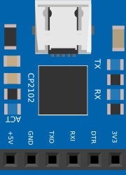
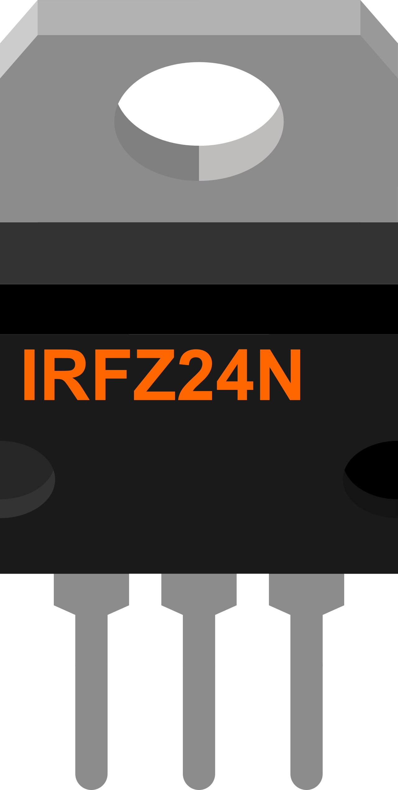

### [Рабочие компоненты для Fritzing - tve_parts]()

В данном материале представлены компоненты (детали) для использования в проектах Fritzing. Детали были получены из других компонентов или построены с нуля. 

### [CP2102 USB UART](https://github.com/Vladimir-Trufanov/Fritzing-parts/blob/main/tve_parts/CP2102%20USB%20UART.fzpz)




### [IRFZ24N - полевой транзистор](https://github.com/Vladimir-Trufanov/Fritzing-parts/blob/main/tve_parts/IRFZ24N.fzpz)

***IRFZ24N*** является мощным n-канальным МОП (MOSFET) транзистором.

```
Максимальное напряжение сток-исток (Uси):    55В;
Максимальный продолжительный ток стока (Iс): 17А;
Максимальный импульсный ток стока (Iс):      68А;
Сопротивление открытого канала (Rси):        70мOм (0.07Ом);
Пороговое напряжение затвор-исток (UGS):     2... 4В;
Максимальное напряжение затвор-исток (Uзи):  ±20В;
Корпус:                                      ТО-220;
```


### [LCD-FM-RX-V2.0](https://github.com/Vladimir-Trufanov/Fritzing-parts/blob/main/tve_parts/LCD-FM-RX-V2.0.fzpz)


### [USB-TTL UART](https://github.com/Vladimir-Trufanov/Fritzing-parts/blob/main/tve_parts/USB-TTL%20UART.fzpz)


