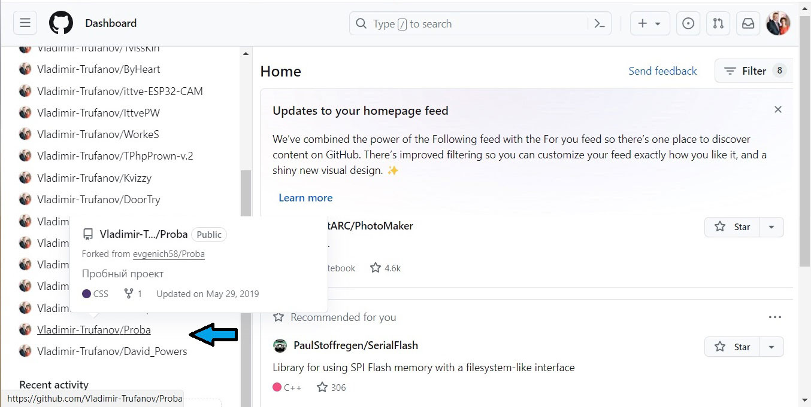
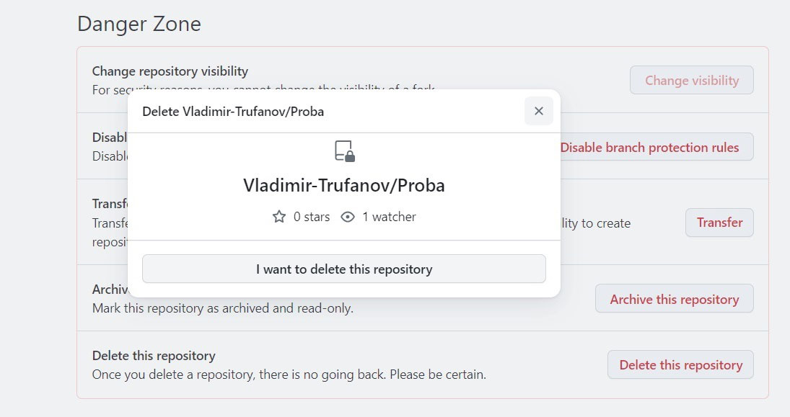
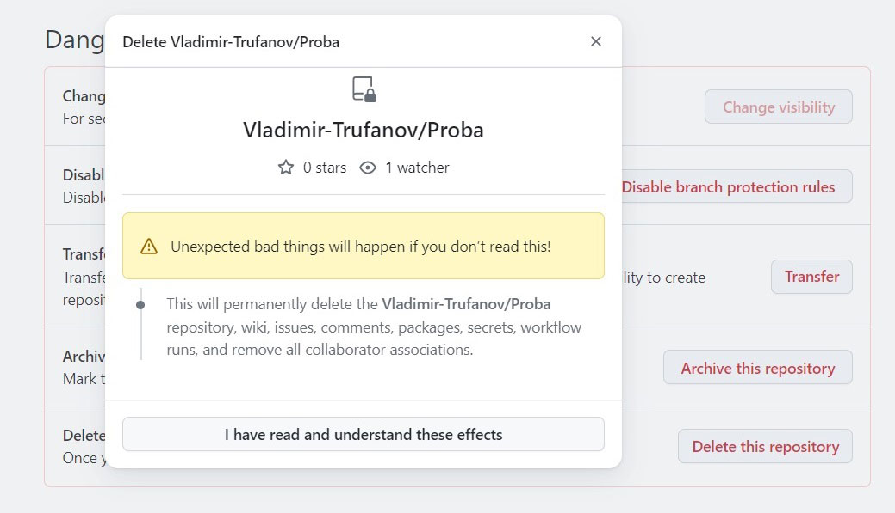
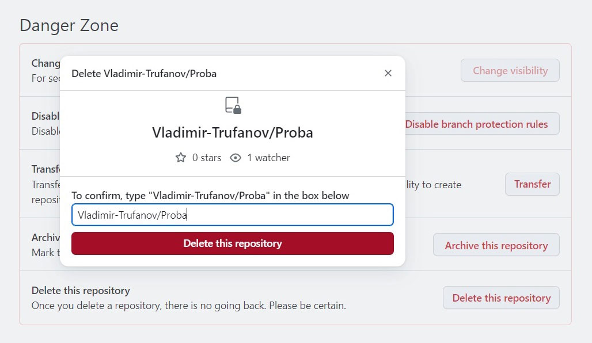
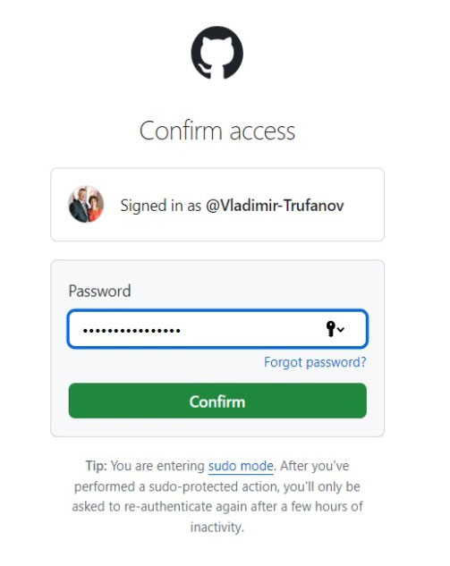

#### Как удалить репозитарий из GitHub [2024-01-19]

Заходим в аккаунт и выбираем репозитарий который хотим удалить, например "***Proba***":



Заходим в репозитарий, кликнув на названии репозитария.

Выбираем в верхней строке меню кнопку "Settings" и щелкаем по ней.


Открывается страница настроек. 

Перемещаемся по странице вниз и находим таблицу "Danger Zone". 

У кнопки "Delete this repository", которую нам предстоит нажать, GitHub предупреждает:

```
Delete this repository
Once you delete a repository, there is no going back. Please be certain.
- - - - - - - - - - - - - - - - - - - - - - - - - - - - - - - - - - - - - 
Удалить этот репозитарий
После удаления репозитария пути назад уже не будет. Пожалуйста, определитесь.
```


Хорошо подумав, нажимаем кнопку "Delete this repository". После чего потребуется еще три раза подтвердить свое желание:







И, напоследок, вводя пароль, подтверждаем работу в своем аккаунте.




